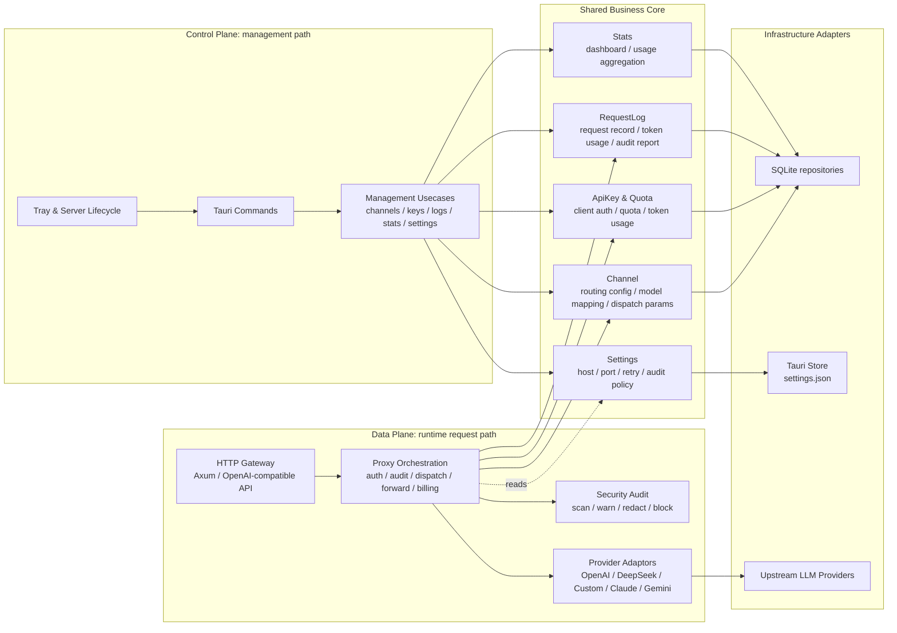

# 后端架构

> 本文档描述 revue-gate 后端（src-tauri）的架构：分层、目录结构、依赖方向与关键流程。
> 技术选型与功能需求见 `docs/Requirements.md`，版本规划见 `docs/roadmap.md`。

## 架构总览

后端架构可以理解为 **API Gateway 架构 + Clean Architecture 分层 + 轻量 DDD 领域建模**：

- **API Gateway 架构**：外部运行职责按 Data Plane / Control Plane 分离。Data Plane 处理真实请求链路，Control Plane 管理配置、渠道、密钥、日志、统计与服务生命周期。
- **Clean Architecture 分层**：内部依赖方向为 `interface → usecases → domain`，`infrastructure → domain`。领域层定义核心类型与 trait，基础设施层提供 SQLite、Store、Provider 等具体适配器实现。
- **轻量 DDD 领域建模**：使用 `Channel`、`ApiKey`、`RequestLog`、`GatewaySettings`、`AuditReport` 等领域模型承载业务概念；使用 `ChannelSelector`、`QuotaPolicy` 等领域服务表达纯业务规则。项目没有采用重型 DDD 的 bounded context、domain event 等复杂机制。

后端是 Tauri 桌面应用内置的本地 LLM API 网关，分两个面：

- **数据面（Data Plane）**：Axum HTTP 服务，对外暴露 OpenAI 兼容接口（`/v1/*`、`/health`），负责认证、安全审计、渠道调度、转发、记账与请求日志。
- **控制面（Control Plane）**：Tauri Commands + 托盘菜单，供前端 React 管理界面和桌面入口调用，负责渠道、客户端密钥、日志、统计、设置与服务生命周期管理。

两条面共用同一套 `usecases → domain → repository` 业务核心，数据面与控制面在 `interface` 层汇合。

### Macro Architecture Diagram



## 核心模块地图

按业务能力理解后端，比只按目录结构理解更清晰。当前核心模块分为基础网关能力和治理/管理能力两组。

### 领域模型与宏观模块的关系

`domain/*.rs` 不应机械理解为“一个文件就是一个宏观模块”。本项目的宏观模块按业务能力划分，通常会跨越多个层：

```text
宏观业务模块 = interface 入口 + usecase 编排 + domain 模型/规则 + infrastructure 适配器
```

例如 Channel 渠道模块包含：

- `domain/channel.rs`：`Channel`、`ModelMapping`、`ChannelRepository` 等领域模型和仓储接口。
- `domain/dispatcher.rs`：`ChannelSelector` 渠道选择规则。
- `usecases/channel.rs`：渠道 CRUD、启停、连通性测试、手动获取模型列表等管理用例。
- `infrastructure/sqlite/channel.rs`：SQLite 仓储实现。
- `interface/commands/channel.rs`：Tauri 控制面入口。

也有一些 `domain` 文件更像“支撑性领域规则”，会服务于其他宏观模块，而不是单独成为一个完整模块。例如：

- `domain/quota.rs` 服务于 ApiKey 认证与配额模块。
- `domain/dispatcher.rs` 服务于 Proxy 转发编排和 Channel 调度。
- `domain/security_audit.rs` 定义安全审计模型与规则，运行时主要挂在 Proxy 转发链路中。
- `domain/stats.rs` 是基于 RequestLog 的统计读模型，通常和 Stats 查询用例一起理解。

因此阅读代码时推荐从“业务能力”出发，再向下定位对应的 `domain/usecases/interface/infrastructure` 文件；不要只按 `domain` 文件数量推导系统模块数量。

### 基础网关能力

| 模块              | 主要位置                                                                          | 职责                                                                                                                   |
| ----------------- | --------------------------------------------------------------------------------- | ---------------------------------------------------------------------------------------------------------------------- |
| HTTP Gateway 入口 | `interface/http`                                                                  | 暴露 OpenAI-compatible HTTP 接口，解析请求、识别流式响应、提取 Bearer token，并把请求交给用例层。                      |
| Proxy 转发编排    | `usecases/proxy.rs`                                                               | 串起认证、安全审计、渠道选择、模型映射、Provider 转发、失败重试、Token Usage 记账和请求日志。                          |
| Channel 渠道      | `domain/channel.rs`、`usecases/channel.rs`、`infrastructure/sqlite/channel.rs`    | 管理上游渠道配置，包括 provider 类型、Base URL、上游 API key、模型列表、优先级、权重、模型映射、启停状态和模型发现。   |
| Provider 适配     | `domain/provider.rs`、`infrastructure/providers/*`                                | 屏蔽 OpenAI、DeepSeek、Custom、Claude、Gemini 等上游协议差异，把内部 OpenAI-compatible 请求转换为对应 provider 请求，并把响应归一化。 |
| ApiKey 认证与配额 | `domain/api_key.rs`、`domain/quota.rs`、`usecases/auth.rs`、`usecases/api_key.rs` | 管理客户端访问本地网关的密钥，负责启停、认证、配额校验与用量累计。注意它不同于 Channel 内保存的上游 provider API key。 |

### 治理与管理能力

| 模块                   | 主要位置                                                                           | 职责                                                                                                                                    |
| ---------------------- | ---------------------------------------------------------------------------------- | --------------------------------------------------------------------------------------------------------------------------------------- |
| RequestLog 请求日志    | `domain/request_log.rs`、`usecases/log.rs`、`infrastructure/sqlite/request_log.rs` | 持久化每次请求的业务记录，包括 API key、渠道、模型、Token Usage、耗时、状态码、trace id、请求体与安全审计报告。                         |
| SecurityAudit 安全审计 | `domain/security_audit.rs`                                                         | 扫描请求体中的消息、tool call、tool schema 与顶层参数，生成风险等级、风险分数、建议动作和 findings；在 enforce 模式下可阻断高风险请求。 |
| Stats 统计             | `domain/stats.rs`、`usecases/stats.rs`、`interface/commands/stats.rs`              | 基于请求日志聚合 dashboard 与 usage 统计，包括请求数、token 数、平均延迟、可用率、按渠道/模型排行等。                                   |
| Settings 配置          | `domain/settings.rs`、`usecases/settings.rs`、`infrastructure/store.rs`            | 管理网关运行配置，包括 host/port、重试策略、安全审计策略、托盘行为、自启动和 UI theme。                                                 |
| Control Plane 入口     | `interface/commands/*`、`lib.rs` tray setup                                        | 通过 Tauri Commands 和托盘菜单接入前端管理操作，负责渠道、密钥、日志、统计、设置和服务生命周期管理。                                    |

## 分层结构与依赖方向

```
interface (入口层)
    ├── http/       Axum 数据面：router + handlers
    └── commands/   Tauri 控制面
        │
        ▼
usecases (用例层)   编排 domain + 调仓储接口，组织数据流
        │
        ▼
domain (领域层)     纯业务规则，零技术依赖
        │
        ▼
infrastructure (基础设施层)   实现仓储接口 + 供应商适配器
    ├── sqlite/     sqlx 仓储实现
    ├── store.rs    settings.json 存储实现（tauri-plugin-store）
    └── providers/  供应商适配器实现
```

**依赖规则**：

- `interface → usecases → domain`，`infrastructure → domain`
- 所有依赖向内指向 domain，**不反向**
- domain 层不出现 `sqlx` / `reqwest` / `axum` / `tauri` 任何技术依赖
- 仓储依赖倒置：domain 定义仓储 trait，infrastructure 提供 sqlx 实现，usecases 只依赖 trait（可 mock 测试）

## 目录结构

> 2024 Edition 模块组织：全部使用 `foo.rs` 命名，不使用 `mod.rs`；子模块以 `foo/bar.rs` 引用为 `crate::foo::bar`。

```
src-tauri/src/
├── main.rs                  # 二进制入口
├── lib.rs                   # 库入口：Tauri Builder + 依赖组装 + 启动 HTTP
├── domain.rs                #   domain 模块入口（pub mod channel / api_key / ...）
├── domain/                  # 领域层：纯业务规则，零技术依赖
│   ├── channel.rs           #   Channel 聚合根：实体 + 模型映射/优先级值对象 + ChannelRepository trait
│   ├── api_key.rs           #   ApiKey 聚合根：实体 + 配额值对象 + ApiKeyRepository trait
│   ├── request_log.rs       #   RequestLog 聚合根：实体 + RequestLogRepository trait
│   ├── provider.rs          #   ProviderAdaptor trait（供应商适配器接口）
│   ├── dispatcher.rs        #   领域服务：渠道选择策略（按模型筛选 → 优先级分组 → 组内权重随机）
│   ├── quota.rs             #   领域服务：配额策略（QuotaPolicy）
│   ├── security_audit.rs    #   安全审计模型、扫描范围、风险 finding 与策略动作
│   ├── settings.rs          #   网关设置模型 + SettingsRepository trait
│   ├── stats.rs             #   日志统计读模型与聚合规则
│   └── error.rs             #   跨仓储接口复用的 RepositoryError
├── usecases.rs              #   usecases 模块入口
├── usecases/                # 用例层：编排 domain + 调仓储，组织数据流
│   ├── proxy.rs             #   转发用例（认证→审计→选渠道→映射→转发→记账→日志）
│   ├── auth.rs              #   认证用例
│   ├── channel.rs           #   渠道 CRUD/测试/模型发现用例
│   ├── api_key.rs           #   密钥 CRUD/配额用例
│   ├── log.rs               #   日志查询用例
│   ├── models.rs            #   模型列表用例
│   ├── stats.rs             #   统计用例
│   └── settings.rs          #   设置用例
├── infrastructure.rs        #   infrastructure 模块入口
├── infrastructure/          # 基础设施层：技术实现
│   ├── sqlite.rs            #   sqlx 连接池 + 内嵌迁移入口
│   ├── sqlite/              #   SQLite 仓储实现
│   │   ├── channel.rs       #     ChannelRepository 的 sqlx 实现
│   │   ├── api_key.rs       #     ApiKeyRepository 的 sqlx 实现
│   │   └── request_log.rs   #     RequestLogRepository 的 sqlx 实现
│   ├── store.rs             #   SettingsRepository 的 tauri-plugin-store 实现
│   ├── providers.rs         #   providers 模块入口
│   └── providers/           #   供应商适配器实现
│       ├── openai.rs        #     OpenAI-compatible passthrough + 模型发现（OpenAI / DeepSeek / Custom）
│       ├── claude.rs        #     Claude 协议转换
│       ├── gemini.rs        #     Gemini 协议转换
│       └── test_util.rs     #     provider adapter 测试工具
├── interface.rs             #   interface 模块入口（pub mod http / commands）
├── interface/               # 入口层
│   ├── http.rs              #   http 模块入口（pub mod router / server）
│   ├── http/                #   Axum 网关（数据面）
│   │   ├── router.rs        #     路由树 + /health
│   │   ├── server.rs        #     服务生命周期（start/stop + 优雅停机）
│   │   └── handlers.rs      #     /v1/* 请求处理器
│   ├── commands.rs          #   commands 模块入口
│   └── commands/            #   Tauri 控制面
│       ├── server.rs        #     服务生命周期命令 + 状态事件
│       ├── channel.rs       #     渠道管理命令（含手动获取模型列表）
│       ├── api_key.rs       #     客户端 API key 管理命令
│       ├── log.rs           #     请求日志查询/删除命令
│       ├── stats.rs         #     统计查询命令
│       └── settings.rs      #     设置读写命令
└── test_support.rs          # 测试用 in-memory 仓储与 mock provider

src-tauri/migrations/        # sqlx 内嵌迁移（非 Rust 模块）
    ├── 001_init.sql         #   建表：channels / api_keys / request_logs / settings 相关
    └── 002_request_log_audit_fields.sql
```

## 分层职责

### domain（领域层）

承载主要业务规则，是架构的核心。领域文件按领域概念和支撑性规则组织：聚合/实体文件随文件放置仓储 trait，纯规则文件只暴露计算逻辑，不依赖 DB、HTTP 或 Tauri。

| 文件                | 内容                                                                                                                                   |
| ------------------- | -------------------------------------------------------------------------------------------------------------------------------------- |
| `channel.rs`        | `Channel` 实体（名称/类型/Base URL/API Key/模型列表/优先级/权重/模型映射/启停状态）+ `ChannelType` 字符串转换权威定义 + `ModelMapping` 值对象 + `ChannelRepository` trait |
| `api_key.rs`        | `ApiKey` 实体（名称/密钥/启停/配额上限/已用额度）+ Local API Key 生成规则 + `Quota` 值对象 + `ApiKeyRepository` trait                   |
| `request_log.rs`    | `RequestLog` 实体（API Key/渠道/模型/Token Usage/耗时/trace id/请求体/状态码/审计报告）+ `RequestLogRepository` trait                  |
| `provider.rs`       | `ProviderAdaptor` trait：`channel_type` / `default_models` / `fetch_models` / `default_base_url` / `test` / `forward` / `forward_stream` |
| `dispatcher.rs`     | 领域服务 `ChannelSelector`：按模型筛选候选渠道 → 按优先级分组 → 组内权重随机                                                           |
| `quota.rs`          | 领域服务 `QuotaPolicy`：校验配额是否超限                                                                                               |
| `security_audit.rs` | 安全审计模型与规则：扫描范围、finding、风险等级、动作聚合、脱敏                                                                        |
| `settings.rs`       | `GatewaySettings`、`RetryPolicy`、审计设置快照 + `SettingsRepository` trait                                                            |
| `stats.rs`          | 基于请求日志的统计读模型与聚合规则                                                                                                     |
| `error.rs`          | 仓储接口共享错误类型                                                                                                                   |

**领域服务 vs 用例**：`dispatcher.rs`、`quota.rs`、`security_audit.rs`、`stats.rs` 只做纯业务判断或聚合计算，不碰 DB 和 HTTP；认证、转发、读写仓储、调用 provider 等编排职责在 `usecases`。

**演进触发线**：单文件超过 ~400 行或出现多个独立子类型时，升级为 `channel/{model,repository,service}` 文件夹结构。

### usecases（用例层）

每个文件对应一组同类用例，编排 domain 实体/领域服务 + 调仓储接口：

- `proxy.rs` — 网关核心闭环：认证 → 安全审计 → 选渠道 → 模型映射 → 转发 → 记账 → 写日志 → 失败重试
- `models.rs` — 模型列表用例：启用渠道模型合并去重，禁用渠道剔除
- `auth.rs` — Bearer 密钥认证 + 配额校验
- `channel.rs` — 渠道 CRUD / 启停 / 连通性测试 / 手动获取 provider-reported 模型列表
- `api_key.rs` — 密钥 CRUD / 配额管理
- `log.rs` — 日志分页 / 多条件查询 / 详情 / 删除
- `stats.rs` — 仪表盘统计（卡片指标 + 7 天聚合）
- `settings.rs` — 设置读写

用例不直接触碰技术细节；DB 通过仓储 trait，错误通过 domain/usecases 定义的 thiserror 错误枚举。

### infrastructure（基础设施层）

实现 domain 定义的接口：

- `sqlite.rs` + `sqlite/` — 用 sqlx 初始化连接池、执行内嵌迁移，并实现各仓储 trait。
- `store.rs` — 用 `tauri-plugin-store` 实现 `SettingsRepository`，持久化 `settings.json`。
- `providers/` — 实现 `ProviderAdaptor`：OpenAI/DeepSeek/Custom 走 OpenAI-compatible 直通和 `GET /models` 模型发现；Claude/Gemini 做协议转换，远程模型发现未实现时显式返回 unsupported。

### interface（入口层）

- `http/` — Axum 数据面：`router.rs` 定义 `/v1/chat/completions`、`/v1/models`、`/health`；`handlers.rs` 解析请求、识别流式、读 Bearer、透传 SSE；挂 `TraceLayer` 结构化日志
- `commands/` — Tauri 控制面：channel / api_key / log / stats / settings 各命令，调用对应 usecases；channel 命令包含 `fetch_channel_models`

## 关键流程

### 转发闭环（数据面）

```
HTTP 请求 /v1/chat/completions
  → http/handlers 解析 JSON、识别 stream、提取 Authorization Bearer
  → auth 用例：校验密钥（401）+ 配额（429）
  → proxy 用例：
      security_audit 生成风险报告，enforce 模式下可阻断，日志保存脱敏 payload
      dispatcher.ChannelSelector 选候选渠道（启用 → 按模型筛选 → 优先级分组 → 组内权重随机）
      ProviderAdaptor 应用模型映射 → 转发上游
      解析 Token Usage → 累加配额 → 写 RequestLog
  → 返回上游响应 / SSE 流式透传
  失败 → 按候选渠道顺序重试下一个（≤ 候选渠道数）
```

### 控制面操作

```
React UI → Tauri Command → usecases → repository trait → sqlx → SQLite
```

### 服务生命周期

```
lib.rs 启动：
  初始化 sqlx 连接池 + 内嵌迁移
  初始化 settings（tauri-plugin-store）
  构建 Axum 服务（host/port 来自设置）
  启动 HTTP：emit server-started 事件（前端 Zustand 订阅刷新）
  托盘菜单：启动/停止服务、退出
```

## 技术选型

| 项          | 选型                         | 说明                                                                 |
| ----------- | ---------------------------- | -------------------------------------------------------------------- |
| Web 框架    | Axum                         | 数据面 HTTP 服务                                                     |
| HTTP 客户端 | Reqwest                      | 转发上游请求                                                         |
| 数据库      | SQLite + sqlx                | `query!` 编译期校验 + 内嵌迁移                                       |
| 错误处理    | thiserror + anyhow           | domain/usecases 用 thiserror 错误枚举；interface/main 用 anyhow 收尾 |
| 配置存储    | tauri-plugin-store           | settings.json 存应用设置；SQLite 只存业务数据                        |
| 运行日志    | tracing + tracing-subscriber | 结构化日志；axum TraceLayer 记录请求；span 贯穿 trace id             |
| ID          | uuid crate v7                | `Uuid::now_v7()` 时间有序主键                                        |
| 时间        | chrono                       | `DateTime<Utc>`，审计时间一律 UTC 存储                               |

## 命名约定

- **领域服务**（domain）：行为命名，如 `ChannelSelector`、`QuotaPolicy`，不用 `_service` 后缀
- **用例**（usecases）：动词 + `Usecase` 后缀，如 `CreateChannelUsecase`、`ProxyRequestUsecase`；避免 `ChannelService` 这类含糊命名
- **仓储**：`<Aggregate>Repository`，如 `ChannelRepository`
- **适配器**：`<Provider>Adaptor`，如 `OpenAiAdaptor`
- **每个源文件开头必须有注释**，描述该文件的作用
