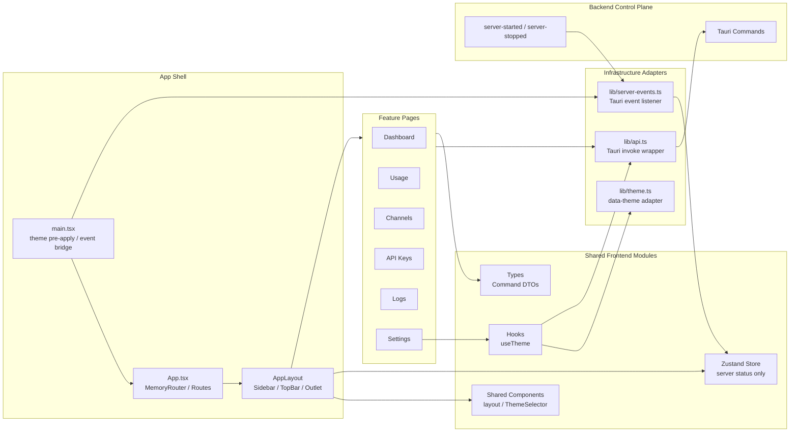

# 前端架构

> 本文档描述 revue-gate 前端（React 管理界面）的架构：目录结构、分层职责、数据通道与关键流程。
> 技术选型与功能需求见 `docs/Requirements.md`，后端架构见 `docs/Architecture-backend.md`。

## 架构总览

前端是 Tauri 桌面应用内置的 React 管理界面（webview），单页应用。它**不直接访问网关数据面**（Axum HTTP，`/v1/*`），所有数据通过 **Tauri Command 控制面**走本地 IPC。

```
React UI ──invoke──► Tauri Command ──► usecases ──► domain ──► SQLite
      ◄──事件/返回──┘        （控制面，见 Architecture-backend.md）
```

当前前端架构可以概括为：**control-plane client + feature-by-page slices + thin infrastructure adapters**。

- **Control-plane client**：前端是网关控制面的桌面管理 UI，不参与 `/v1/*` 数据面转发。
- **Feature-by-page slices**：`pages/*` 是主要业务承载位置，一个页面对应一组用户任务，如渠道管理、密钥管理、日志查看、设置。
- **Thin infrastructure adapters**：`lib/api.ts` 封装 Tauri Command 调用，`lib/server-events.ts` 封装后端事件监听，页面不直接散落 `invoke` / `listen`。
- **Minimal global state**：只有服务运行状态进入 Zustand；业务列表、表单、弹窗、加载态都留在页面本地。

结构参考 WaLiAPI（`pages/` + `components/` + `lib/` + `types/`，无独立业务 store 层），业务代码按页面就近组织，**不照搬后端分层**——前端只表达调用、展示与交互边界。

对这个项目来说，React + TypeScript 前端应优先按页面任务划分，而不是按后端式 Clean Architecture 继续拆出 `domain` / `usecases` / `infrastructure`。原因是前端的主要复杂度来自页面交互、表单状态、展示状态和后端 Command 调用编排；这些复杂度天然围绕用户正在操作的页面聚合。

### Macro Architecture Diagram



这张图的读法是：

- **Shell 负责装配**：入口、路由、布局、导航、顶栏状态，不承载页面业务。
- **Feature Pages 负责业务交互**：每个页面自己加载数据、维护表单/弹窗/加载态，并通过 `lib/api.ts` 调用后端。
- **Shared Frontend Modules 只放跨页复用**：布局、主题控件、主题 hook、服务状态 store、共享类型。
- **Adapters 隔离外部机制**：Tauri `invoke`、Tauri event、DOM theme attribute 都收束在 `lib/`。

## 目录结构

```
src/
├── main.tsx                  # 入口：预应用主题 + StrictMode + 挂载 + 启动 server 事件监听
├── app/
│   └── App.tsx               # 组装 Layout + 集中定义 Routes（薄壳）
├── pages/                    # 路由入口；业务逻辑就近放页面目录内
│   ├── dashboard/            #   仪表盘（统计卡片 + 7 天趋势）
│   ├── usage/                #   用量统计（日期范围 + 渠道/模型排行）
│   ├── channels/             #   渠道管理
│   ├── api-keys/             #   密钥管理
│   ├── logs/                 #   请求日志
│   └── settings/             #   设置中心
├── components/               # 跨页复用组件
│   ├── layout/               #   侧边栏、顶栏、应用外壳
│   └── ThemeSelector.tsx     #   主题选择控件
├── stores/                   # Zustand store（仅 useServerStore）
├── hooks/                    # 跨页复用 hooks（如 useTheme）
├── lib/                      # 基础设施封装：tauri api / 事件 / 主题 / 常量
│   ├── api.ts                #   Command 按域封装（channelApi / logApi / ...）
│   ├── server-events.ts      #   server-started/stopped 事件桥接
│   ├── theme.ts              #   主题三态应用
│   └── constants.ts          #   渠道类型 label、默认模型列表、格式化函数等
├── types/                    # 跨页共享类型（index.ts 集中导出）
└── styles/                   # 全局样式、Tailwind 入口、CSS 变量
```

## 分层职责

前端文档采用混合视角：先说明技术层如何协作，再说明页面如何对应业务模块。技术层帮助你判断代码应该放哪里；页面模块帮助你理解每块 UI 背后的用户任务。

本项目约定：**页面是前端业务模块的基本单位**。更精确地说，`src/pages` 下一个页面目录对应一个页面模块，目录内的 `XxxPage.tsx` 对应一个实际路由页面；同目录下的 `ChannelForm.tsx`、`ApiKeyForm.tsx` 这类文件是页面私有子模块，不单独对应路由。只有当某段实现确实跨多个页面复用时，才提升到共享目录。

### app / main.tsx（应用组装）

- `main.tsx`：先用 `getStoredTheme()` + `applyTheme()` 预应用主题，再 `ReactDOM.createRoot` + `<StrictMode>`，并调用 `setupServerEvents()` 启动事件桥接
- `App.tsx`：只做组装——`Layout` 包 `Routes`，集中定义 6 个页面路由；不写业务逻辑、不塞启动副作用

### pages（路由入口 + 业务载体）

每个页面一个目录，目录内的 `XxxPage.tsx` 是路由入口。页面可以包含自己的私有表单、表格、图表或弹窗文件；这些文件服务于该页面模块，不会出现在路由表中。

| 路由 | 页面入口文件 | 页面模块 | 对应 Command 封装 |
| --- | --- | --- | --- |
| `/dashboard` | `dashboard/DashboardPage.tsx` | 仪表盘：统计卡片 + 7 天趋势折线 | `statsApi` |
| `/usage` | `usage/UsagePage.tsx` | 用量统计：日期范围用量趋势 + 渠道/模型排行 | `statsApi.usage` |
| `/channels` | `channels/ChannelsPage.tsx` | 渠道管理：CRUD / 启停 / 测试 / 模型映射 / 手动获取模型列表 / 排序 | `channelApi` |
| `/api-keys` | `api-keys/ApiKeysPage.tsx` | 密钥管理：CRUD / 配额管理 | `apiKeyApi` |
| `/logs` | `logs/LogsPage.tsx` | 请求日志：分页 / 筛选 / 详情 / 删除 | `logApi` |
| `/settings` | `settings/SettingsPage.tsx` | 设置中心：端口 / 主题 / 托盘 / 自启 / 重试策略 / 安全审计 | `settingsApi` / `serverApi` |

业务代码**就近放页面目录内**，只有真正被多处复用的才提升到 `components/` / `hooks/`。不建空目录、不为对称性建目录。

## 核心业务模块

前端的核心业务模块不是后端那种 `domain/usecases/infrastructure` 分层模块，而是面向用户任务的页面模块。一个页面模块通常包含：

- 页面入口 `XxxPage.tsx`
- 页面私有的表单、表格、图表、弹窗等小模块
- 页面本地状态：列表数据、筛选条件、表单草稿、加载态、错误态
- 对 `lib/api.ts` 中某个 Command 封装的调用

| 前端模块 | 用户任务 | 主要代码 | 后端能力 |
| --- | --- | --- | --- |
| Dashboard | 快速查看网关当天和累计运行情况 | `pages/dashboard/DashboardPage.tsx` | `statsApi.get` |
| Usage | 查看一段时间内的用量趋势、渠道排行、模型排行 | `pages/usage/UsagePage.tsx` | `statsApi.usage` |
| Channels | 管理上游渠道、模型映射、启停、连通性测试和 provider-reported 模型列表 | `pages/channels/*` | `channelApi` |
| API Keys | 管理客户端访问密钥和配额 | `pages/api-keys/*` | `apiKeyApi` |
| Logs | 查询请求日志、查看详情、清理日志 | `pages/logs/LogsPage.tsx` | `logApi` |
| Settings | 管理服务监听、主题、托盘、自启、重试、安全审计 | `pages/settings/SettingsPage.tsx` | `settingsApi` / `serverApi` |

判断一个新功能应该放在哪里，可以先问：这个功能主要服务哪个页面任务？如果只被一个页面使用，就留在该页面目录；如果被两个以上页面自然复用，再提升到 `components/`、`hooks/` 或 `lib/`。

### 页面模块内部结构

有表单和列表的页面通常采用“Page + private form”的结构：

```text
pages/channels/
├── ChannelsPage.tsx   # 路由页面入口：列表、加载、错误、弹窗开关、CRUD 动作编排
└── ChannelForm.tsx    # 页面私有表单：输入状态、校验、submit

pages/api-keys/
├── ApiKeysPage.tsx    # 路由页面入口：列表、启停、删除、一次性密钥展示
└── ApiKeyForm.tsx     # 页面私有表单：名称、配额、启用状态
```

这种结构下，`XxxPage.tsx` 的职责偏“页面编排”：

- 页面首次加载时调用 `load()` 获取列表；
- 保存、删除、启停后决定是重新拉取还是局部替换；
- 管理当前弹窗是否打开、正在测试哪一行、是否展示一次性密钥等页面状态；
- 处理错误提示、空状态、加载态。

`XxxForm.tsx` 的职责偏“输入收集”：

- 维护表单字段的本地状态；
- 做最靠近输入的轻量校验；
- 组装 `ChannelInput` / `ApiKeyInput` 这样的 Command input DTO；
- 调用对应 `api` adapter 保存；
- 保存成功后通过 `onSaved(saved)` 把结果交还给页面入口。

这类表单目前仍放在页面目录内，因为它们只服务对应页面；还不是全局 `components/`。

另一类页面是“查询/展示型页面”，例如 `dashboard/`、`usage/`、`logs/`：

- `DashboardPage.tsx`：读取聚合统计，展示指标卡片和 7 天趋势。
- `UsagePage.tsx`：维护日期范围、排行 tab、排序字段，并展示用量图表和排行表。
- `LogsPage.tsx`：维护筛选条件、分页、详情弹窗、删除动作，并展示请求日志和安全审计报告。

这些页面即使文件较长，也不一定需要立刻拆到共享目录。判断是否拆分时看两个问题：

- 这段 UI 或逻辑是否只服务当前页面？
- 拆出去之后，调用方的 interface 是否更小、更清晰？

如果答案是“只服务当前页面”，可以拆成同目录私有文件，例如 `LogDetailModal.tsx`、`AuditReportPanel.tsx`；但不应提升到 `components/`，除非其他页面也自然复用。

### components（复用组件）

- `layout/`：侧边栏、顶栏、应用外壳
- `ThemeSelector.tsx`：跨 TopBar 与 SettingsPage 复用的主题选择控件
- 当前代码没有独立 `components/ui/`；如果后续引入 shadcn/ui，应保持生成物不含业务
- 业务组件复用超过一个页面时放入 `components/`（如 `ChannelForm.tsx`），否则留在页面目录

在 React 概念里，component 是页面的组成单位，页面本身也是 component。但在本项目目录约定里，`src/components/` 的定位是跨页面复用层，不是所有 UI 片段的默认归宿。放入这里的模块应满足至少一个条件：

- 被多个页面或布局共同使用；
- 表达应用级结构，如 Sidebar、TopBar、AppLayout；
- 是稳定的基础 UI 构件，且不依赖某个页面的业务状态。

当前实际结构：

| 模块 | 职责 | 为什么在 `components/` |
| --- | --- | --- |
| `layout/AppLayout.tsx` | 应用外壳：Sidebar + TopBar + `Outlet` | 所有路由页面共享 |
| `layout/Sidebar.tsx` | 主导航 | 应用级导航，不属于某个页面 |
| `layout/TopBar.tsx` | 当前页面标题、服务状态、主题选择 | 所有页面共享的顶部区域 |
| `layout/nav.ts` | 导航配置 | Sidebar 渲染导航，TopBar 解析当前页面标题 |
| `ThemeSelector.tsx` | 主题三态选择控件 | TopBar 和 SettingsPage 复用 |

反例也很重要：`ChannelForm.tsx`、`ApiKeyForm.tsx` 虽然是 React 组件，但它们只服务对应页面模块，因此留在 `pages/channels/` 和 `pages/api-keys/`。这能保持业务上下文集中，避免 `components/` 变成难以导航的混合目录。

### stores / hooks（跨页状态）

- **唯一全局 store `useServerStore`**：`{ running, host, port }`，**只被 server 事件写入**，全局读取（顶栏状态灯、设置页、状态展示）
- 业务数据**不进 store**：各页面本地 `useState` + `load()`，CRUD 后就地刷新
- 跨页复用 hooks 才放 `hooks/`，未复用前留在使用处

### stores/use-server-store.ts（Global Server Status Store）

`useServerStore` 是当前唯一的 Zustand store，只保存本地网关服务的运行状态：

```ts
{
  running: boolean;
  host: string | null;
  port: number | null;
}
```

它之所以进入全局 store，是因为这个状态同时满足三个条件：

- **跨页面读取**：TopBar 要展示状态灯和监听地址，SettingsPage 要展示启动/停止按钮和当前 endpoint。
- **后端事件驱动**：真实状态来自 `server-started` / `server-stopped` 事件，而不是某个页面自己计算出来。
- **需要全局一致**：如果设置页启动服务，顶栏必须马上同步；如果服务从托盘或后端生命周期变化，所有页面看到的状态也要一致。

反过来，渠道列表、密钥列表、日志列表、统计数据都没有进入 store，因为它们主要服务单个页面，且本地 Tauri IPC 查询成本很低。把这些业务数据塞进全局 store，反而会引入缓存失效、跨页面同步和刷新时机的问题。

因此，本项目的状态管理原则是：**全局 store 只保存少量真正全局、事件驱动、需要一致性的状态；页面业务数据留在页面本地。**

### hooks/use-theme.ts + lib/theme.ts（Theme State Line）

主题是一条独立的前端状态线，但没有放进 Zustand。它由三个小模块协作完成：

| 模块 | 角色 | 职责 |
| --- | --- | --- |
| `hooks/use-theme.ts` | Theme hook | 读取后端设置、维护当前 theme、切换时保存设置 |
| `lib/theme.ts` | DOM theme adapter | `applyTheme()` 设置或移除 `document.documentElement[data-theme]` |
| `components/ThemeSelector.tsx` | Controlled UI | 只接收 `theme` 和 `onChange`，负责展示浅色/深色/跟随系统按钮 |

主题没有进入 `useServerStore`，原因是它和 server status 的性质不同：

- server status 由后端生命周期事件驱动，需要全局实时同步；
- theme 是用户偏好设置，变化点少，TopBar 和 SettingsPage 各自通过 `useTheme()` 读取即可；
- 真正影响全局 UI 的不是 JS store，而是 `data-theme` 和 CSS 变量。

主题切换流程如下：

```text
ThemeSelector click
  -> useTheme.changeTheme(next)
  -> localStorage writes first-frame cache
  -> applyTheme(next)
  -> settingsApi.get()
  -> settingsApi.save({ ...settings, theme: next })
```

这里有两个细节：

- `localStorage` 只作为首帧缓存，避免页面渲染前闪烁；持久化权威仍是后端 settings。
- `system` 不设置 `data-theme`，由 CSS `@media (prefers-color-scheme: dark)` 响应系统主题，不需要 JS 监听系统变化。

这里使用自定义 hook 的原因不是“React 逻辑都要抽 hook”，而是主题逻辑同时满足：

- **跨组件复用**：TopBar 和 SettingsPage 都需要当前主题和切换能力。
- **包含 React 状态**：需要维护当前 `theme`，并处理加载期间用户已切换主题的竞态。
- **包含副作用协调**：要同步 `localStorage`、DOM `data-theme` 和后端 settings。
- **对组件暴露小 interface**：组件只需要 `const { theme, changeTheme } = useTheme()`。

因此，`useTheme` 是一个有价值的 hook：它隐藏了主题状态线的实现细节，让调用方只关心“当前主题是什么”和“如何切换主题”。如果某段逻辑只服务一个页面，或只是简单的事件处理函数，就不需要为了形式感抽成 hook。

### lib（基础设施层）

| 文件 | 职责 |
| --- | --- |
| `api.ts` | `invoke` 的按域薄封装：`xxxApi = { cmd: () => invoke<T>("cmd", args) }`；类型从 `types/` 导入；错误统一转换 |
| `server-events.ts` | `listen("server-started"/"server-stopped")` → 写 `useServerStore`；模块级幂等标志 |
| `theme.ts` | `applyTheme(theme)` 设置 `data-theme` 属性 |
| `constants.ts` | 渠道类型/协议 label、渠道静态默认模型列表、时间/数字格式化等纯函数 |

### lib/api.ts（Tauri Command Adapter）

`lib/api.ts` 是前端最重要的基础设施 adapter。它的职责不是实现业务规则，而是把页面里的用户动作转换成后端 Tauri Command 调用。

本项目约定：**`api.ts` 是唯一直接调用 `invoke` 的地方**。页面不直接写：

```ts
invoke("list_channels")
```

而是调用：

```ts
channelApi.list()
```

这样做有三个好处：

- **调用点集中**：后端 Command 改名、参数变更、返回值调整时，优先检查 `api.ts` 和 `types/index.ts`。
- **按业务域分组**：页面看到的是 `channelApi`、`apiKeyApi`、`logApi`、`statsApi` 这些前端语义，而不是一堆散落的 Command 字符串。
- **返回值类型化**：`invoke<T>` 的 `T` 来自 `types/index.ts`，让页面拿到的是 `Channel[]`、`LogPage`、`GatewaySettings` 等明确结构。

当前 `api.ts` 按后端控制面能力分为六组：

| Adapter | 主要职责 | 后端 Command 示例 |
| --- | --- | --- |
| `serverApi` | 查询、启动、停止本地网关服务 | `get_server_status` / `start_server` / `stop_server` |
| `settingsApi` | 读取和保存网关设置 | `get_settings` / `save_settings` |
| `channelApi` | 渠道 CRUD、启停、连通性测试、手动获取模型列表 | `list_channels` / `create_channel` / `test_channel` / `fetch_channel_models` |
| `apiKeyApi` | 客户端密钥 CRUD、启停、配额 | `list_api_keys` / `create_api_key` / `set_api_key_enabled` |
| `logApi` | 请求日志查询、详情、清理 | `list_logs` / `get_log_detail` / `clear_logs` |
| `statsApi` | 仪表盘统计和用量统计 | `get_stats` / `usage_stats` |

从依赖方向看，页面依赖 `api.ts`，`api.ts` 依赖 Tauri `invoke` 和共享类型；页面不需要知道后端内部是 usecase、domain 还是 SQLite。

### lib/server-events.ts（Server Event Bridge）

`lib/server-events.ts` 是后端服务生命周期事件到前端全局状态之间的桥接层。它监听 Tauri event，并把事件 payload 写入 `useServerStore`。

当前监听两类事件：

| Event | 含义 | 前端动作 |
| --- | --- | --- |
| `server-started` | 本地网关服务已启动，包含 `running/host/port` | 写入 `useServerStore`，TopBar 和 SettingsPage 自动刷新 |
| `server-stopped` | 本地网关服务已停止 | 写入 `useServerStore`，清空运行 endpoint |

这里的关键原则是：**server status 的权威源是后端事件，而不是页面按钮的乐观更新**。

例如 SettingsPage 点击“启动服务”时，页面只调用：

```ts
serverApi.start()
```

它不会直接把 `running` 改成 `true`。真正的状态更新流程是：

```text
SettingsPage click
  -> serverApi.start()
  -> Tauri Command start_server
  -> backend emits server-started
  -> server-events.ts listens
  -> useServerStore.applyStatus()
  -> TopBar / SettingsPage re-render
```

这样做可以避免前端状态和后端真实状态不一致。比如启动失败、端口被占用、后端选择随机端口时，前端最终展示的都是后端确认后的状态。

另外，`setupServerEvents()` 内部有模块级 `started` 标志，保证监听只注册一次，避免 React StrictMode 或重复初始化导致重复监听。启动时还会调用一次 `serverApi.status()` 做初始校准，用来处理 webview 加载晚于后端启动事件的情况。

### lib/constants.ts（Shared Constants）

`lib/constants.ts` 存放跨页面共享的静态常量和纯映射。它不持有状态，不调用后端，也不操作 DOM。

当前主要内容：

| 常量 | 用途 |
| --- | --- |
| `APP_NAME` | Sidebar 品牌区域展示应用名 |
| `CHANNEL_TYPE_LABELS` | 把 `ChannelType` 映射成页面展示用 label |
| `DEFAULT_CHANNEL_MODELS` | 渠道表单的静态默认模型列表；远程获取失败时保留当前列表 |

这类常量适合放在 `lib/`，因为它们是多个 UI 模块共同依赖的基础信息。例如渠道类型 label 既可能被 `ChannelsPage` 使用，也可能被后续日志详情、设置或表单复用。

判断规则：

- 只服务一个页面的 label/map，先留在页面文件内；
- 被多个页面或布局复用的静态映射，放到 `lib/constants.ts`；
- 会变化、需要用户保存或后端读取的数据，不放在 constants，而应走 settings 或 Command。

### styles/index.css（Global Style Tokens）

`styles/index.css` 是前端全局样式入口，主要承担三类职责：

- 引入 Tailwind CSS 4；
- 定义语义化颜色变量，例如 `--background`、`--foreground`、`--card`、`--primary`；
- 连接主题状态：`data-theme="light"` / `data-theme="dark"` / system。

页面和组件通常不直接写具体颜色，而是使用语义类名：

```tsx
className="bg-background text-foreground border-border"
```

这些类最终映射到 CSS variables。主题切换时，`lib/theme.ts` 只改变根节点上的 `data-theme`，页面组件无需重新理解颜色规则。

当前主题规则：

| 状态 | DOM 表现 | CSS 来源 |
| --- | --- | --- |
| light | `data-theme="light"` | `:root` light defaults，且阻止系统 dark 覆盖 |
| dark | `data-theme="dark"` | `[data-theme="dark"]` dark variables |
| system | 无 `data-theme` | `@media (prefers-color-scheme: dark)` 自动响应 |

Tailwind 4 的 `@theme inline` 把 CSS variables 暴露成 `bg-background`、`text-muted-foreground` 等工具类。`@custom-variant dark (&:where([data-theme="dark"]))` 则让 `dark:` 只跟随显式 dark，而不是系统 dark。

因此，本项目的视觉样式原则是：**组件使用语义 token，主题差异集中在全局 CSS variables 中处理**。

### types/index.ts（Command DTO Projection）

`types/index.ts` 可以理解为前端集中存放 DTO 的地方。更准确地说，它是后端 Tauri Command 入参/出参在 TypeScript 侧的类型投影，目标是让页面和 `api.ts` 拿到稳定、可检查的数据形状。

需要注意：这里的类型主要对应**后端暴露给前端的 Command 契约**，不等同于数据库实体，也不一定等同于完整 domain entity。它们应当以 Command 入参/出参为准，和后端 `serde` 输出保持一致。

典型关系如下：

```ts
// api.ts
channelApi.list(): Promise<Channel[]>

// types/index.ts
interface Channel { ... }

// backend command
list_channels -> Vec<Channel>
```

当前类型大致分为几类：

| 类型类别 | 示例 | 用途 |
| --- | --- | --- |
| 服务状态 | `ServerStatus` | 顶栏、设置页展示本地网关是否运行 |
| 渠道管理 | `Channel` / `ChannelInput` / `ModelMapping` | 渠道列表、表单、模型映射、手动获取模型列表 |
| 密钥管理 | `ApiKey` / `ApiKeyInput` / `Quota` | 客户端密钥列表、配额表单 |
| 日志与审计 | `RequestLog` / `LogPage` / `LogDetail` / `AuditReport` | 日志列表、详情、安全审计结果展示 |
| 统计 | `StatsSnapshot` / `UsageStats` / `DailyStat` / `RankRow` | 仪表盘、用量统计 |
| 设置 | `GatewaySettings` / `RetryPolicy` / `AuditSettings` / `Theme` | 设置页、主题、重试、安全审计策略 |

维护规则：

- 后端 Command 字段命名变化时，优先同步 `types/index.ts`。
- `api.ts` 的 `invoke<T>` 泛型必须引用这里的类型。
- 页面私有 UI 状态不要放进 `types/index.ts`，例如弹窗开关、表单草稿字符串、排序 tab，应留在页面文件内。
- 如果某个类型只服务一个页面且不是 Command 契约，可以先留在页面文件内，等跨页复用时再提升。

## 状态管理策略

| 状态类型 | 归属 | 依据 |
| --- | --- | --- |
| 服务运行状态 | `useServerStore` | 跨页全局、由后端事件驱动，唯一需要全局共享 |
| 主题/设置 | `useTheme()` + 设置页本地状态 + `applyTheme()` | 首帧读本地缓存，挂载后以后端 settings 校准；无需全局 store |
| 业务列表（渠道/密钥/日志/统计） | 页面本地 `useState` + `load()` | 本地 IPC 毫秒级，重新拉取零成本，全局同步是多余复杂度 |
| 表单/弹窗/加载态 | 页面本地 `useState` | 单页面瞬态 |

**不引入 TanStack Query / SWR**：它们为 HTTP 网络缓存设计，本地 Command 场景是过度设计。

## 关键流程

### 数据通道（页面 → 后端）

```
页面 load() ──► lib/api.ts (channelApi.list) ──invoke──► Tauri Command ──► usecases ──► SQLite
      ◄── typed result（Channel[] 等）────────────────────┘
```

- `api.ts` 是全项目唯一的 `invoke` 调用点；后端加命令只改这一个文件 + `types/`
- 返回值类型化（`invoke<T>`），与后端 Command 签名对齐

### 服务状态桥接（后端 → 前端）

```
main.tsx setupServerEvents()
  ├── listen("server-started", e → useServerStore.setState({ running: true, host, port }))
  ├── listen("server-stopped",  → useServerStore.setState({ running: false }))
  └── 模块级标志位幂等（StrictMode 双挂载防重复注册）
```

- **事件是唯一权威源**：前端"启动/停止服务"按钮调 `serverApi.start()` → 按钮 `loading` 态 → 等事件回调最终同步，**不自改 store**，状态永远与后端一致
- **首挂载校准（唯一例外）**：webview 晚于启动事件加载，会错过 boot 事件，故 `setupServerEvents()` 启动时经 `get_server_status` 校准一次初始状态——写入的仍是后端权威状态，不是前端自改；此后常规刷新一律靠事件
- 事件常驻监听，不随 App 生命周期清理

### 主题应用

```
首帧: getStoredTheme() → applyTheme(theme)
挂载后: settingsApi.get() → useTheme 校准
切换时: ThemeSelector → changeTheme(next) → applyTheme(next) → settingsApi.save(...)
```

- 三态 `light` / `dark` / `system`，`data-theme` 属性 + CSS 语义变量
- `system` 态不写暗色变量，由 CSS `@media (prefers-color-scheme: dark)` 响应，零 JS 监听
- Tailwind 4：`@custom-variant dark (&:where([data-theme="dark"]))` 让 `dark:` 变体跟随 `data-theme`

## 技术选型

| 项 | 选型 | 说明 |
| --- | --- | --- |
| 构建 | Vite 7 + TS + React 19 | 需求文档锁定，见 `docs/Requirements.md` |
| 路由 | React Router 7 + `MemoryRouter` | Tauri 场景不依赖 URL history API，刷新/文件协议下更稳 |
| 状态管理 | Zustand（仅 server store） | 唯一全局状态 |
| UI | Tailwind CSS 4 + Lucide | 当前未引入独立 `components/ui/`；如后续使用 shadcn/ui，应隔离生成物 |
| 数据通道 | Tauri Command（`invoke`） | 不直连网关 HTTP 数据面 |
| 事件 | `@tauri-apps/api` `listen` | server 状态桥接 |
| 主题 | CSS 变量 + `data-theme` | 三态，跟随系统零 JS |
| 路径别名 | `@/` → `src/` | vite + tsconfig 各配一条 |

## 命名约定

- **页面组件**：`XxxPage.tsx`（`DashboardPage`）
- **Command 封装**：`lib/api.ts` 中按域 `xxxApi`（`channelApi` / `logApi`）
- **Store**：`useServerStore`（hooks 风格）
- **复用组件**：PascalCase（`ChannelForm.tsx`）
- **类型**：`types/index.ts` 集中导出；`interface` 用于可扩展公共契约，`type` 用于 union/mapped
- **常量**：`lib/constants.ts`
- **每个源文件开头必须有注释**，描述该文件的作用（与后端约定一致）

## 与后端的分界

- 前端只走 **控制面**（Tauri Command）；数据面（Axum `/v1/*`）对前端透明，前端可以管理渠道和密钥配置，但不参与 provider 调度、请求转发和记账执行
- 类型以 Command 签名为准，`types/` 与 Tauri Command 的入参/出参一一对应
- server 状态由后端 `emit` 事件驱动，前端不做轮询
