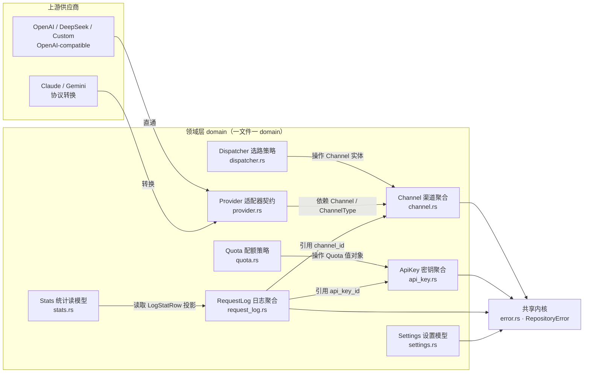

# Domain 上下文映射图（Context Map）

> 本文档描述后端领域层（`src-tauri/src/domain/`）的领域划分、各领域职责与边界、领域之间的关系。以实际代码为准。

## 定位

- 本图聚焦 **domain 层内部**；interface / usecases / infrastructure 的角色见 [后端架构](../../Architecture-backend.md)。
- 遵循"**一聚合一文件**"约定：**一个文件对应一个领域单元（domain）**——聚合根、领域服务、适配器契约、设置模型各占一文件，仓储 trait 随聚合根放置。
- revue-gate 是单进程、单用户桌面应用，这些 domain 是**概念边界**（代码内聚 + 不变量归属），不是可独立部署的模块。

## 领域速览（TL;DR）

**有哪些 domain，各做什么？**

| domain | 作用 | 文件 |
| --- | --- | --- |
| Channel 渠道聚合根 | `Channel` 实体（配置）+ `ModelMapping` 值对象 + `ChannelRepository` trait | `channel.rs` |
| Dispatcher 选路策略（领域服务） | `ChannelSelector`：按模型筛选 → 优先级分组 → 组内权重随机，产出有序 failover 队列 | `dispatcher.rs` |
| ApiKey 密钥聚合根 | `ApiKey` 实体（密钥/启停）+ `Quota` 值对象 + `ApiKeyRepository` trait | `api_key.rs` |
| Quota 配额策略（领域服务） | `QuotaPolicy`：`used >= limit` 判超限（应返 429），`limit = None` 恒放行 | `quota.rs` |
| RequestLog 日志聚合根 | `RequestLog` 实体 + `LogQuery` 过滤语义 + `RequestLogRepository` | `request_log.rs` |
| Provider 适配器契约 | `ProviderAdaptor` trait + `TokenUsage` 等传输类型：上游协议差异和模型发现能力的防腐层 | `provider.rs` |
| Stats 统计读模型 | `LogStatRow` / `DailyStat` / `UsageStats`：基于请求日志轻量投影的聚合模型 | `stats.rs` |
| Settings 设置模型 | `GatewaySettings` + `RetryPolicy` + `AuditSettings` + `SettingsRepository` | `settings.rs` / `security_audit.rs` |
| Error（共享类型） | `RepositoryError`，被所有仓储 trait 共用，不是业务 domain | `error.rs` |

**各 domain 之间什么关系？**

- **类型依赖（强）**：Dispatcher → Channel（选路策略操作 `Channel` 实体）；Quota → ApiKey（配额策略操作 `Quota` 值对象）。
- **类型依赖**：Provider → Channel（适配器消费 `Channel` / `ChannelType` 选适配器）。
- **数据引用（仅 ID）**：RequestLog → Channel / ApiKey（日志只存 `channel_id` / `api_key_id`）。
- **读模型投影**：Stats ← RequestLog（统计只读取轻量投影，不反向影响日志实体）。
- **共享内核**：Channel / ApiKey / RequestLog / Settings → Error（统一返回 `RepositoryError`）。
- **防腐层（ACL）**：Provider ↔ 上游，协议差异锁死在 `infrastructure/providers/`。
- **编排协调**：`usecases/proxy.rs` 是唯一的跨 domain 编排入口，domain 内互不编排。

## 上下文总览

## 各 domain 详解

### 1. Channel 渠道聚合根（`channel.rs`）

**职责**：聚合上游渠道配置，作为选路与转发的数据来源。

- `Channel` 实体（`channel.rs:40`）：名称 / 类型 / Base URL / API Key / 模型列表 / 优先级 / 权重 / 模型映射 / 启停状态。
- `ModelMapping` 值对象（`channel.rs:30`）：统一客户端模型名 ↔ 上游实际模型名；未映射时直通。
- `ChannelRepository` trait（`channel.rs:70`）：定义持久化接口，sqlx 实现在 infra。

**边界（不做）**：不选路（Dispatcher）、不实现上游协议（Provider）、不编排转发与重试（usecases）、不持久化（infra）。**红线**：`api_key` 明文不得暴露给下游、不得明文写入请求日志（`channel.rs:47` 注释）。

### 2. Dispatcher 选路策略（领域服务，`dispatcher.rs`）

**职责**：决定"哪个渠道能服务哪个模型、谁先谁后"。

- `ChannelSelector`（`dispatcher.rs:21`）：启用 → 按模型筛选（`supports`，`dispatcher.rs:75`）→ 优先级分组 → 组内权重随机。无状态纯函数，RNG 注入以便测试。

**边界（不做）**：只操作 `Channel` 实体，不碰 DB / HTTP；按序重试的编排在 proxy usecase。

### 3. ApiKey 密钥聚合根（`api_key.rs`）

**职责**：网关本地密钥签发与配额数据。

- `ApiKey` 实体（`api_key.rs:31`）：名称 / 密钥明文 `sk-revue-*` / 启停 / 配额。密钥明文只在创建命令返回一次，其余读取返回掩码预览。
- `generate_local_key`：Local API Key 生成规则归属 domain，格式为 `sk-revue-<16 hex>`。
- `Quota` 值对象（`api_key.rs:20`）：`limit`（None = 不限）+ `used`（已消耗）。
- `ApiKeyRepository` trait（`api_key.rs:46`）：按明文查 key（认证用）、CRUD。

**边界（不做）**：不判超限（Quota）、不负责配额持久化累加（usecases）、不解析认证协议（http handler / auth usecase）。

### 4. Quota 配额策略（领域服务，`quota.rs`）

**职责**：判定密钥配额是否超限。

- `QuotaPolicy`（`quota.rs:18`）：`used >= limit` 判定超限（应返 429）；`limit = None` 恒放行。

**边界（不做）**：只读 `Quota` 值对象（定义在 `api_key.rs`），不碰 DB / HTTP；找 key 与写回用量在 usecases。

### 5. RequestLog 日志聚合根（`request_log.rs`）

**职责**：一次请求的完整审计记录 + 过滤查询 + 统计投影。

- `RequestLog` 实体（`request_log.rs:17`）：api_key_id / channel_id / 模型 / usage / 耗时 / trace id / 请求体 / 状态码 / 是否流式重试。
- `LogQuery`（`request_log.rs:52`）与 `LogQuery::matches`（`request_log.rs:80`）：**过滤语义的唯一权威定义**，sqlx 实现从它生成等价 WHERE。
- `RequestLogRepository` trait：写入、详情查询、分页过滤、删除、清空，以及 `stat_rows(...)` 轻量投影读取。

**边界（不做）**：不聚合统计；统计类型与聚合函数在 `domain/stats.rs`，用例在 `usecases/stats.rs`。RequestLog 只引用其他 domain 的 **ID**，不持有对方实体。

### 6. Provider 适配器契约（`provider.rs`）

**职责**：网关与上游供应商之间的**防腐层（ACL）**，把各供应商协议差异隔离在契约之后。

- `ProviderAdaptor` trait：7 个方法（`channel_type` / `default_models` / `fetch_models` / `default_base_url` / `test` / `forward` / `forward_stream`）。**只暴露 domain 类型，不透出 reqwest / axum**；`forward_stream` 返回 OpenAI 兼容 SSE 字节流，数据面只透传。
- 规范化类型：`TokenUsage`（各家 token 字段归一）、`ChatRequest`、`ProviderResponse`、`StreamEvent`、`TestResult`。
- `ProviderError`：只表达"未配置 / 不支持 / 传输 / 解析失败"；**上游业务错误（4xx/5xx）不在此表达**，`forward` 保留状态码，但把错误体替换为通用错误 JSON，是否重试由转发用例决定。

**边界（不做）**：不实现协议转换（OpenAI/DeepSeek/Custom 直通、Claude/Gemini 转换全部锁死在 `infrastructure/providers/`）；不决定重试策略（proxy usecase）。不支持远程模型发现的 provider 通过 `ProviderError::Unsupported` 显式说明。

### 7. Stats 统计读模型（`stats.rs`）

**职责**：基于 `request_logs` 的轻量读模型和纯聚合函数。

- `LogStatRow`（`stats.rs:11`）：统计所需的轻量行，不包含 `request_body`、错误详情或审计报告。
- `DailyStat` / `RankRow` / `UsageStats`：仪表盘和用量页使用的聚合结果。
- `aggregate_dashboard` / `aggregate_usage`：纯 Rust 聚合逻辑，统一 Token、可用率和本地日期桶口径。

**边界（不做）**：不查询数据库；`RequestLogRepository::stat_rows` 负责读取投影，用例负责把投影交给 domain 聚合。

### 8. Settings 设置模型（`settings.rs`）

**职责**：网关本地配置快照，其中重试策略直接约束转发闭环的失败行为。

- `GatewaySettings`（`settings.rs:45`）：host / port / theme / 托盘行为 / 开机自启 / `RetryPolicy` / `AuditSettings`。
- `RetryPolicy`（`settings.rs:27`）：`enabled=false` 只试首个候选；`enabled=true` + `max_retries=None` 无限重试（保持逐渠道尝试的默认行为）。
- `AuditSettings`（`security_audit.rs`）：请求审计开关、模式、扫描范围、payload 保存和证据级别。
- `SettingsRepository` trait（`settings.rs:78`）。

**边界（不做）**：不持久化（tauri-plugin-store 在 infra）；不实现重试循环（proxy usecase 消费 `RetryPolicy`）。

### 9. Error 共享类型（`error.rs`）

**职责**：仓储错误的统一表达，被所有仓储 trait 返回。

- `RepositoryError`（`error.rs:7`）：`NotFound` / `Database(String)`。底层 sqlx 错误转成字符串，**不把 sqlx 类型带进 domain**（保持零技术依赖）。

**边界（不做）**：不是业务 domain，无自己的不变量；只在 domain 与 infra 之间传递错误。

## domain 间关系

| 关系类型 | 涉及 | 说明 |
| --- | --- | --- |
| **类型依赖（强）** | Dispatcher → Channel | 选路策略操作 `Channel` 实体（`dispatcher.rs:16`） |
| **类型依赖（强）** | Quota → ApiKey | 配额策略操作 `Quota` 值对象（定义在 `api_key.rs`） |
| **类型依赖** | Provider → Channel | 适配器消费 `Channel` / `ChannelType` 选适配器（`provider.rs:11`） |
| **数据引用（仅 ID）** | RequestLog → Channel / ApiKey | 日志只存 `channel_id` / `api_key_id`，不持有对方实体 |
| **读模型投影** | Stats ← RequestLog | `stat_rows` 读取日志轻量投影，`domain/stats.rs` 负责纯聚合 |
| **共享内核** | Channel / ApiKey / RequestLog / Settings → Error | 仓储 trait 统一返回 `RepositoryError` |
| **防腐层（ACL）** | Provider ↔ 上游 | 协议差异是变化最频繁、最不可控的外部边界；转换逻辑锁死在 `infrastructure/providers/` |
| **编排（协调者）** | usecases/proxy.rs | domain 内互不编排；认证 → 选渠道 → 映射 → 转发 → 记账 → 写日志的闭环由 proxy usecase 跨 domain 协调 |

## 边界规则（不得跨 domain）

1. **domain 之间只允许"类型引用"与"ID 引用"**，不允许互相调用编排逻辑；跨 domain 的流程一律上提 usecases。
2. **协议转换不得越过 Provider**；任何新供应商接入 = 在 infra 新增 adapter，不改 domain 契约、不动 proxy。
3. **密钥与日志的明文红线**：渠道 API Key、密钥明文不得流回下游或进入日志；掩码是控制面读取的默认行为。
4. **仓储 trait 定义在 domain、实现在 infra**，usecases 只依赖 trait——domain 间不直接依赖具体持久化。

## 演进触发线

- **渠道配置 / 模型映射规模扩大**：`channel.rs` 超过 ~400 行 → 升级为 `channel/{model,repository,service}` 文件夹（`dispatcher.rs` 同理）。
- **新供应商非 OpenAI-compatible 协议**：Provider 内新增 adapter 即可，trait 不变。
- **配额维度复杂化**（多维度 / 刷新周期）：`Quota` 从值对象升级为独立聚合根（带自己的实体与仓储），`QuotaPolicy` 相应扩展。
- **多用户 / 多租户**：当前"单用户本地密钥"假设崩塌，ApiKey 升级为完整身份上下文，配额与认证语义随之重构。
