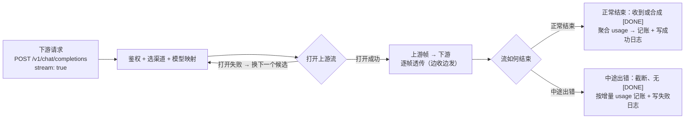

# HTTP Server & SSE

> 数据面入口：在 Tauri 应用内嵌一个 Axum HTTP 服务器，对外暴露 OpenAI 兼容端点（`/v1/*`、`/health`），负责认证、转发、SSE 流式透传与 trace id 贯穿。

## 为什么需要

revue-gate 的对外价值是「一个统一的 OpenAI 兼容端点」。这个端点必须是一个**真正的 HTTP 服务器**，而不是 Tauri 命令：下游 SDK / 客户端按 OpenAI 协议发 `POST /v1/chat/completions`，网关要原样兼容（含流式 `text/event-stream`）。因此数据面是一套独立的 Axum 服务，内嵌在 Tauri 进程里，与控制面（Tauri Commands）在 `interface` 层汇合。

选择 Axum 的理由：类型安全的状态提取（`State` / `Extension`）、`from_fn` 函数式中间件、原生 `Body::from_stream` 对 SSE 的契合，以及 `tower` 生态（`TraceLayer`、`oneshot` 测试）可直接复用。

## 设计思路

### 模块与职责

位置：`src-tauri/src/interface/http/`，是数据面（Data Plane）的完整实现。

| 文件                         | 职责                                                                           |
| ---------------------------- | ------------------------------------------------------------------------------ |
| `interface/http.rs`          | 模块入口，声明 `handlers` / `router` / `server`                                |
| `interface/http/server.rs`   | `ServerManager`：服务器生命周期（bind / serve / 优雅停机），与路由、Tauri 解耦 |
| `interface/http/router.rs`   | `build_router`：路由树 + trace / CORS 中间件装配                               |
| `interface/http/handlers.rs` | 请求处理器、trace id 中间件、错误→状态码映射                                   |

依赖方向：`server` 只认 `axum::Router`（路由树由调用方组装后传入），`router` 只认 `AppState`，`handlers` 调用 usecases——全部向内指向 domain，不反向。服务器生命周期与「有哪些路由」彻底解耦。

### AppState：数据面共享状态

`handlers.rs` 里的 `AppState` 是数据面 handler 的**依赖注入容器**，经 `with_state(...)` 注入路由树，`#[derive(Clone)]` + 内部 `Arc` 实现廉价共享：

| 字段           | 类型                         | 谁用                                                  |
| -------------- | ---------------------------- | ----------------------------------------------------- |
| `proxy`        | `Arc<ProxyRequestUsecase>`   | `chat_completions`（认证→选渠道→映射→转发→记账→日志） |
| `channel_repo` | `Arc<dyn ChannelRepository>` | `models`（列启用渠道模型并去重）                      |

`channel_repo` 单独拎出是因为 `/v1/models` 走 `ListModelsUsecase`、不经过 proxy 用例；字段用 `Arc<dyn ChannelRepository>` 是仓储依赖倒置，测试可塞内存实现（Seam A/B）。

### 路由树与中间件

`build_router`（`router.rs`）挂三条路由，并包两层中间件：

```text
/health                GET  → 静态存活探针
/v1/chat/completions   POST → chat_completions（流式 + 非流式）
/v1/models             GET  → models（合并去重）
```

中间件注册顺序（`.layer()` 后写者在外层，最外层最先运行）：

1. **`TraceLayer::new_for_http()`**（最内层）：`TraceIdSpan` 建 span、`TraceOnResponse` 在响应后打结构化日志。
2. **`trace_id_middleware`**（中层）：复用/生成 `x-request-id` 并塞进 request extensions，响应时回显该头。
3. **`CorsLayer::permissive()`**（最外层）：任意 origin / method / header、无 credentials，供浏览器端下游（NextChat web）跨域访问；放在最外层让 preflight `OPTIONS` 在鉴权前就被短路（`OPTIONS` 不带 Authorization，不能让它打到 auth）。

trace id 贯穿的实现：外层中间件先 `insert(TraceId)` → `TraceLayer` 建 span 时 `extensions().get::<TraceId>()` 读出来写进 span 字段 → 下游所有日志都挂在这个 span 下，靠 `trace_id` 字段关联同一条请求。

### 服务器生命周期（ServerManager）

`server.rs` 的 `ServerManager` 只做「bind / serve / 优雅停机」，内部状态只有 `Arc<Mutex<Option<RunningServer>>>`：

- `Option<RunningServer>` **本身编码运行态**：`Some` = 在跑、`None` = 没跑，不另设 `bool`。
- `RunningServer` 是运行中实例的**句柄集合**：`addr`（观察）+ `shutdown_tx`（停机信号）+ `task`（后台任务，`stop()` 里 `await` 它保证端口关闭后才返回）。
- `Arc`：后台任务退出时要 `inner.lock().take()` 清空注册（服务器自挂后状态一致、可重启），故任务也要持有 `inner`。
- `Mutex`：管理方法与后台任务并发读写同一状态。
- `oneshot`：一次性、无数据的停机信号，`shutdown_rx.await` 喂给 `with_graceful_shutdown`（取消安全）。

`start()` 的关键时序：**先 `TcpListener::bind`（异步，不持锁）→ 短临界区检查 `AlreadyRunning` → spawn 后台任务 → 登记句柄 → 返回实际 `SocketAddr`**（`port=0` 时是内核随机端口）。`stop()` = `take()` 拿掉实例 → `shutdown_tx.send(())` 触发优雅停机 → `task.await` 等真正退出。

### 请求处理与错误映射

`chat_completions`（`handlers.rs`）的职责边界：**只做解析与映射，业务在 usecase**。

1. 解析 JSON body（失败 → 400）。
2. `extract_bearer` 取 Bearer（**缺 Bearer 直接 401**，先于一切特性开关，流式请求无豁免）。
3. 组装 `ProxyRequest`，调 `state.proxy.execute(...)`。
4. 结果映射：`NonStream` → `application/json` 原样透传；`Stream` → `text/event-stream` 逐帧转发；`Err` → `proxy_error_response`。

`ProxyError` → HTTP 状态码一对一（详见 [Proxy.md](./Proxy.md)）：

| `ProxyError` 变体                           | HTTP |
| ------------------------------------------- | ---- |
| `Unauthorized`                              | 401  |
| `QuotaExceeded`                             | 429  |
| `NoCandidateChannel(_)`                     | 404  |
| `NoChannelAvailable { .. }` / `Provider(_)` | 502  |
| `Repository(_)`                             | 500  |
| `InvalidRequest(_)`                         | 400  |
| `SecurityPolicyBlocked`                     | 403  |

错误体统一为 OpenAI 风格 `{"error":{"message":...,"type":...}}`。多数错误的 `type` 按状态码映射（`authentication_error` / `rate_limit_error` / ...）；安全策略阻断特化为 `security_policy_blocked`，供下游与普通 403 区分。

## 非流式链路

非流式请求（`stream: false`）的转发闭环同样跨越多层：

1. **handler**（`handlers.rs`）：解析 JSON → `extract_bearer` 取 Bearer → 组装 `ProxyRequest`（`stream=false`）→ 调 `state.proxy.execute(...)`。
2. **usecase**（`proxy.rs`）：认证 → 选渠道 → 模型映射 → 逐个候选 `forward`，retryable 失败换下一个，成功即返回 `ProviderResponse`（status + body + usage）。
3. **记账**：成功时按 usage total 累加配额（best-effort，失败只 `warn` 不回 5xx）。
4. **写日志**：每次尝试各写一条 `RequestLog`（成功 / 失败）。
5. **handler 映射**：`NonStream` → `application/json` + 上游状态码原样透传（4xx / 5xx 不篡改）。

关键语义（详见 [Proxy.md](./Proxy.md)）：

- **4xx 客户端错误不重试**，原样透传（换 provider 可能掩盖 bug）；retryable（传输错 / 429 / 5xx）才换下一个候选。
- 上游密钥不向下游暴露：适配器把上游错误体收敛成通用错误体。

## SSE 流式链路

流式请求（`stream: true`）是本项目的重点：网关的价值不只在于聚合上游，更在于**把流式响应实时、无损地透传下去**，保住 LLM 的「低首字延迟」体验——用户看到第一个 token 就开始了，而不是等整个响应生成完。

### SSE 协议速览

SSE 本质是「一次 HTTP 请求，服务端分多帧推送的无限长响应体」：

- 响应头 `Content-Type: text/event-stream` + `Cache-Control: no-cache`（禁止中间层缓存）。
- 帧格式 `data: <payload>\n\n`，空行分隔相邻帧；payload 逐帧累积，边到边下发。
- OpenAI 约定以 `data: [DONE]` 帧表示流正常结束。

### 设计思路

**1. 透传而非聚合。** 流式响应的价值在「边生成边下发」。网关若缓冲整个响应再转发，等于把流式退化成非流式、抵消了首字延迟优势。所以必须「边收边发」：上游每来一帧，立刻原样写给下游。

**2. 响应头的时间约束划出两类失败。** 状态码与响应头一旦发出就不能再改，这定义了流式请求的「不归点」：

- **打开流之前失败**（连不上上游、上游返回 4xx / 5xx）——响应头未发，照常走 retryable 失败的重试换渠道逻辑，与是否流式无关。
- **打开流之后中途失败**——响应头已发、状态码定格 200，**无法跨渠道续接**（把两个上游的流拼成一个下游流在协议上不成立）。客户端看到的是「已下发帧 + 截断、无 `[DONE]`」；网关侧写失败日志并按已聚合的增量 usage 记账。

**3. `[DONE]` 是流的结束信号。** 下游以 `data: [DONE]` 表示正常结束。上游有的原生透传，有的（Claude / Gemini）用不同协议、没有这个概念，由转换适配器在流正常结束时合成这一帧。流结束即响应结束。

**4. 协议差异隔离在适配器。** 下游统一 OpenAI SSE 格式，上游分两类：OpenAI-compatible（OpenAI / DeepSeek / Custom）帧格式本就兼容，直通；非 OpenAI（Claude / Gemini）事件结构不同，适配器把上游事件流转换成下游 SSE 帧。上游的错误帧同样在此收敛成通用错误体，不向下游暴露上游密钥或原文。

**5. 记账必须推迟到流结束。** 非流式在响应结束即有完整 usage，可立刻记账；流式的 usage 随帧累积（增量散布在 chunk，或最后才给 total），只能在流结束（正常结束或出错）时聚合再记账。中途出错按已聚合的增量 usage 记账——已经产生的 token 不能丢。

**6. trace id 贯穿整个流生命周期。** 流式响应时间跨度长，中间件生成的 `trace_id` 要在转发、记账、写日志全程保持，结构化日志靠它把同一请求的多条记录关联起来。

### 流程图

宏观链路（各节点的设计依据见上节设计思路）：



图里最关键的分叉是 `E`：**流式请求的「不归点」在「打开上游流成功」那一刻**——此前失败可以重试换渠道（回到 `B`），此后失败只能截断（`G`），无法续接。

### 代码位置

| 环节 | 位置 | 说明 |
| --- | --- | --- |
| 响应映射 | `interface/http/handlers.rs` 的 `chat_completions` | `ProxySuccess::Stream` → `Body::from_stream`，响应头 `text/event-stream` + `no-cache` |
| 流式转发 + 记账 | `usecases/proxy.rs` | `forward_stream` 打开上游流；`wrap_stream_bookkeeping` 在流结束 / 出错时聚合 usage、记账、写日志 |
| 流式边界类型 | `domain/provider.rs` | `StreamEvent` / `TokenUsage` / `ChatRequest` / `ProviderResponse` |
| 协议适配 | `infrastructure/providers/` | OpenAI/DeepSeek/Custom 直通；Claude/Gemini 转换 + 合成 `[DONE]` |

转发 / 重试 / 记账的完整编排见 [Proxy.md](./Proxy.md)。

## 与控制面的接缝

`interface/commands/server.rs` 是数据面的**控制入口**：`start_server` / `stop_server` 命令（及托盘菜单）驱动 `ServerManager` 生命周期。

- `start_gateway`：`build_router(app.state::<AppState>().inner().clone())` 组装路由 → `ServerManager.start(...)` → 广播 `server-started`（携带实际监听地址）。**广播失败则回滚**（`stop()` 后返回错误）——事件是前端状态的唯一权威源，不允许「已启动但前端不知道」。
- `stop_gateway`：`ServerManager.stop()` 优雅停机后广播 `server-stopped`。
- `resolve_host_port`：显式参数 → 共享设置 → 默认值，统一监听地址解析（命令、托盘、setup 自动启动共用）。
- 前端 `useServerStore` 只由 `server-started` / `server-stopped` 事件写入（首挂载经 `get_server_status` 校准一次是唯一例外）。

## 测试

- **server.rs（Seam B）**：`ServerManager` 生命周期——start 后端口可连、stop 后端口拒绝连接、重复 start 报 `AlreadyRunning`、空闲 stop 报 `NotRunning`、stop 后可重启（新端口）。
- **router.rs（Seam B）**：`tower::oneshot` 验证 `/health` 200、未知路由 404。
- **handlers.rs（Seam B，真实 HTTP 闭环）**：真实 SQLite + 真实适配器 + mock 上游，覆盖非流式透传 + 日志落库 + 配额累加 + trace 回显、无 Bearer 401、无效 Bearer 401、**SSE 流式含 `[DONE]` 收尾并记账**、**流中断截断 + 增量 usage 记账**、流式无 Bearer 401、配额 429、结构化日志携带 trace id、坏 JSON 400、`/v1/models` 合并去重（剔除禁用渠道）。
