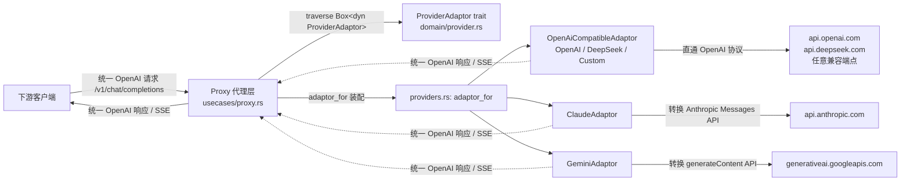

# 渠道适配器模块

> 本文档描述供应商适配器（`ProviderAdaptor`）的设计与实现，以实际代码为准。
> 契约定义在 `src-tauri/src/domain/provider.rs`，实现全部在 `src-tauri/src/infrastructure/providers/`。

## 为什么需要渠道适配器

目标：对外暴露统一的 OpenAI 兼容协议，对内对接多家 AI 供应商，隔离各家的协议差异。

OpenAI / DeepSeek / Custom 都走 OpenAI-compatible 直通；Claude（Anthropic Messages API）和 Gemini（generateContent API）需要协议转换。转换逻辑被锁死在 `infrastructure/providers/` 目录内（Spec decision 6），domain 层与代理用例（`usecases/proxy.rs`）只依赖 trait，不感知具体协议。

## 架构图



## 核心抽象：ProviderAdaptor

`domain/provider.rs` 定义统一契约，共 7 个方法。**trait 只暴露 domain 类型，不出现 reqwest / axum 等技术类型**；`forward_stream` 返回 OpenAI 兼容的 SSE 字节流，数据面只透传。

```rust
#[async_trait::async_trait]
pub trait ProviderAdaptor: Send + Sync {
    /// Channel type this adapter handles (used for routing / adapter selection).
    fn channel_type(&self) -> ChannelType;
    /// Default model list when creating a channel (for frontend form prefill).
    fn default_models(&self) -> Vec<String>;
    /// Provider-reported model list; unsupported providers return ProviderError::Unsupported.
    async fn fetch_models(&self, channel: &Channel) -> Result<Vec<String>, ProviderError>;
    /// Default Base URL; Custom returns None with no default (the channel must configure it explicitly).
    fn default_base_url(&self) -> Option<&'static str>;
    /// Connectivity test: probes the model-list endpoint of each provider, returns latency and failure reason.
    async fn test(&self, channel: &Channel) -> Result<TestResult, ProviderError>;
    /// Non-streaming forward: build the upstream request, convert the protocol, parse usage.
    async fn forward(&self, channel: &Channel, request: &ChatRequest)
        -> Result<ProviderResponse, ProviderError>;
    /// Streaming forward: returns an OpenAI-compatible SSE byte stream with per-frame parsed usage.
    async fn forward_stream(&self, channel: &Channel, request: &ChatRequest)
        -> Result<BoxStream<'static, Result<StreamEvent, ProviderError>>, ProviderError>;
}
```

两种转发方式（`forward` / `forward_stream`）覆盖流式与非流式；`test` 提供连通性探测。

## 相关类型（`domain/provider.rs`）

| 类型 | 位置 | 字段 / 变体 |
| --- | --- | --- |
| `ChatRequest` | :58 | `model`（映射后的上游模型）、`stream`、`body`（OpenAI 兼容原始 JSON 请求体） |
| `ProviderResponse` | :70 | `status_code`、`body`（转换后的字节体）、`usage` |
| `StreamEvent` | :80 | `data`（OpenAI 兼容 SSE 字节）、`usage`（该帧携带的用量，若有） |
| `TestResult` | :87 | `ok`、`latency_ms`、`error` |
| `TokenUsage` | :16 | `prompt_tokens` / `completion_tokens` / `total_tokens`（适配器统一各家 token 字段）；提供 `normalized()`（total 缺失时由前两项推导）与 `accumulate()`（流式逐帧累加，饱和加法） |
| `ProviderError` | :96 | `NotConfigured` / `Unsupported` / `Request` / `InvalidResponse`。**不含上游业务错误**，`forward` 保留上游状态码，但把非 2xx 错误体替换为通用错误 JSON，重试决策交给代理用例 |

## 适配器实现（`infrastructure/providers/`）

| 实现 | 适配渠道 | 协议处理 |
| --- | --- | --- |
| `OpenAiCompatibleAdaptor`（openai.rs） | OpenAI / DeepSeek / Custom | **直通**：请求体原样转发；非流式响应原样中继并解析 Token Usage；流式逐帧中继 SSE 原始字节，`SseUsageScanner` 行缓冲解析 usage（只读解析，不改动中继字节）；模型发现走 `GET {base_url}/models` |
| `ClaudeAdaptor`（claude.rs） | Claude | **转换**：system 消息拆入独立 `system` 字段、其余消息映射；缺 `max_tokens` 注入默认值；响应 Anthropic 结构 → OpenAI `chat.completion`；流式逐帧转 `chat.completion.chunk` 并追加 `[DONE]` |
| `GeminiAdaptor`（gemini.rs） | Gemini | **转换**：system 拆入 `systemInstruction`、user/assistant 映射到 `contents.parts`；缺 `max_tokens` 注入默认值；响应 `candidates` → OpenAI `chat.completion`；流式走 `:streamGenerateContent?alt=sse`，逐帧转 chunk 并追加 `[DONE]` |

默认值与连通性测试：

- `default_models` / `default_base_url`：OpenAI / DeepSeek 有内置默认（如 `gpt-4o`、`https://api.openai.com/v1`）；**Custom 无任何默认**，渠道必须显式配置。
- `fetch_models`：OpenAI-compatible provider 使用 `GET {base_url}/models` 解析 `data[].id`；Claude/Gemini 当前未实现远程模型发现时返回 `ProviderError::Unsupported`，前端保留当前/默认列表。
- `test`：探测各家的模型列表端点（`GET {base_url}/models`，Claude / Gemini 用各自模型端点），2xx 记为成功，返回延迟与失败原因。

## 装配（`infrastructure/providers.rs`）

```rust
pub fn adaptor_for(channel_type: ChannelType) -> Box<dyn ProviderAdaptor> {
    match channel_type {
        ChannelType::OpenAi | ChannelType::DeepSeek | ChannelType::Custom =>
            Box::new(openai::OpenAiCompatibleAdaptor::new(channel_type)),
        ChannelType::Claude => Box::new(claude::ClaudeAdaptor::new()),
        ChannelType::Gemini => Box::new(gemini::GeminiAdaptor::new()),
    }
}
```

目录内共享辅助函数（`pub(super)`）：`resolve_base_url`（渠道显式配置优先，否则回退适配器默认，都没有则报配置错）、`require_api_key`（渠道未配上游密钥报错）、`extract_text_content`（抽取 OpenAI `content` 纯文本供 Anthropic / Gemini 转换）、`chunk_event` / `finish_event`（构建 OpenAI 流式 chunk 帧）、`usage_to_json` 等。

## 安全红线：上游错误体不回显

OpenAI 兼容端点的 401 错误体会**回显提交的密钥**（`Incorrect API key provided: sk-...`）。因此 `forward` / `forward_stream` 遇非 2xx 时丢弃上游错误体，替换为通用错误 JSON / SSE 帧（保留状态码，`upstream_error_body` / `upstream_error_event`）——上游密钥不得下发下游。

## 测试

- 各适配器内联 `#[cfg(test)] mod tests`，配合 `infrastructure/providers/test_util.rs`（axum 起的 mock 上游）覆盖：连通性成功/失败、模型发现成功/异常、请求转换与响应还原、SSE 逐帧转换 + `[DONE]` 收尾、错误体密钥遮蔽、跨 chunk 的 usage 行缓冲解析。DeepSeek 通过 OpenAI-compatible seam 覆盖 provider identity、默认值、请求和响应映射。
