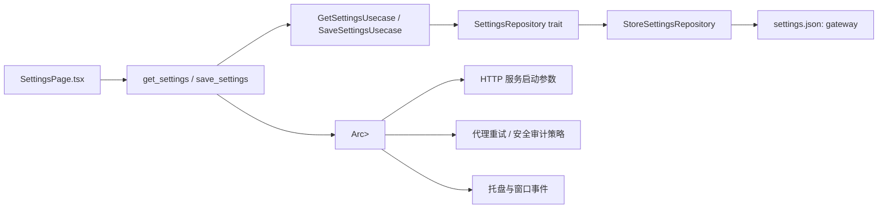

# 应用设置

## 设计目标

Settings 是应用控制面的用户偏好快照，负责保存“网关如何启动、窗口如何表现、请求策略如何运行”等配置。它不承载结构化业务数据，也不记录运行日志；这些仍由 SQLite 管理。

当前实现围绕一个完整快照建模：

- 后端领域模型：`src-tauri/src/domain/settings.rs` 的 `GatewaySettings`
- 后端持久化：`src-tauri/src/infrastructure/store.rs` 的 `StoreSettingsRepository`
- 后端命令：`src-tauri/src/interface/commands/settings.rs` 的 `get_settings` / `save_settings`
- 前端类型：`src/types/index.ts` 的 `GatewaySettings`
- 前端页面：`src/pages/settings/SettingsPage.tsx`

## 设置项总览

| 设置项 | 后端字段 | 前端字段 | 默认值 | 作用范围 | 说明 |
| --- | --- | --- | --- | --- | --- |
| 服务监听 Host | `host` | `host` | `127.0.0.1` | HTTP 服务启动 | 保存时去除首尾空白；空字符串拒绝保存。 |
| 服务监听端口 | `port` | `port` | `3000` | HTTP 服务启动 | `0` 表示随机可用端口；前端限制为 `0..=65535`。 |
| 界面主题 | `theme` | `theme` | `system` | 前端 UI | 枚举：`light` / `dark` / `system`。 |
| 最小化到托盘 | `minimize_to_tray` | `minimizeToTray` | `false` | Tauri 窗口事件 | 最小化后隐藏窗口，托盘恢复窗口。 |
| 关闭到托盘 | `close_to_tray` | `closeToTray` | `false` | Tauri 窗口事件 | 拦截关闭事件并隐藏窗口；托盘“退出”绕过该拦截。 |
| 开机自启 | `autostart` | `autostart` | `false` | 操作系统启动项 | 基于 `tauri-plugin-autostart`。 |
| 失败重试开关 | `retry.enabled` | `retry.enabled` | `true` | 代理转发用例 | 关闭后只尝试第一个候选渠道。 |
| 最大重试次数 | `retry.max_retries` | `retry.max_retries` | `null` | 代理转发用例 | `null` 表示无上限；数字表示首次失败后的额外尝试次数。 |
| 请求审计开关 | `audit.enabled` | `audit.enabled` | `false` | 安全审计策略 | 关闭时不执行请求审计。 |
| 请求审计模式 | `audit.mode` | `audit.mode` | `observe` | 安全审计策略 | 枚举：`observe` / `enforce`。 |
| 拦截 critical 风险 | `audit.block_critical` | `audit.blockCritical` | `true` | 安全审计策略 | 仅在 enforce 模式下产生阻断效果。 |
| 扫描 system messages | `audit.scan_system_messages` | `audit.scanSystemMessages` | `false` | 安全审计策略 | 控制 system message 是否进入审计范围。 |
| 扫描字节上限 | `audit.scan_byte_limit` | `audit.scanByteLimit` | `65536` | 安全审计策略 | 前端限制为 `0..=10000000`。 |
| 保存原始请求体 | `audit.store_payload` | `audit.storePayload` | `true` | 请求日志/审计记录 | 控制审计相关日志是否保留 payload。 |
| 证据级别 | `audit.evidence_level` | `audit.evidenceLevel` | `summary` | 安全审计报告 | 枚举：`summary` / `detailed`。 |

## 存储策略

项目使用两类本地存储：

- SQLite：存储结构化业务数据，包括 Channel、API Key、Request Log、统计读模型等。
- Tauri Store：存储应用设置快照，文件名为 `settings.json`，顶层 key 为 `gateway`。

Settings 不进入 SQLite，原因是它的语义是低频更新的本地偏好快照，而不是需要查询、关联、分页或迁移的业务表。`tauri-plugin-store` 提供 JSON 文件持久化，配合 Rust `serde` 类型即可完成读取、默认值回填和保存。

### 序列化形态

`GatewaySettings` 使用 `#[serde(rename_all = "camelCase", default)]`，所以快照外层字段与前端字段一致；`RetryPolicy` 没有 `rename_all`，因此内部字段保持 `max_retries`；`AuditSettings` 自身使用 camelCase。

示例：

```json
{
  "host": "127.0.0.1",
  "port": 3000,
  "theme": "system",
  "minimizeToTray": false,
  "closeToTray": false,
  "autostart": false,
  "retry": {
    "enabled": true,
    "max_retries": null
  },
  "audit": {
    "enabled": false,
    "mode": "observe",
    "blockCritical": true,
    "scanSystemMessages": false,
    "scanByteLimit": 65536,
    "storePayload": true,
    "evidenceLevel": "summary"
  }
}
```

`#[serde(default)]` 是兼容策略：旧版本 JSON 缺少新增字段时，反序列化会回填默认值。

## 分层设计



### Domain

`GatewaySettings` 是完整设置快照。保存时采用整包覆盖，不做局部 patch，避免前后端字段分散更新后出现半状态。

`SettingsRepository` 是领域 trait，仅定义 `load` / `save`，不暴露 Tauri Store、文件路径或 JSON key。

### Usecase

`GetSettingsUsecase` 只负责读取设置；当仓储无已保存值时返回 `GatewaySettings::default()`。

`SaveSettingsUsecase` 的顺序是：

1. 校验 `host.trim()` 非空。
2. 规范化 `host`，去除首尾空白。
3. 调用仓储保存完整快照。
4. 返回规范化后的快照给命令层。

### Infrastructure

`StoreSettingsRepository` 用 `tauri-plugin-store` 保存设置：

- 文件：`settings.json`
- key：`gateway`
- `load`：无值时返回默认设置；反序列化失败时返回仓储错误。
- `save`：`set` 后显式调用 `save()`，保证命令返回前已 flush 到磁盘。

应用启动时如果设置读取失败，会记录 warn 并使用默认设置启动，避免坏配置导致整个应用不可用。

### Command

`save_settings` 是前端进入后端的信任边界，保存顺序是：

1. 校验输入。
2. 根据 `autostart` 同步操作系统启动项。
3. 持久化设置快照。
4. 将规范化后的快照写入 `Arc<RwLock<GatewaySettings>>`。

共享状态是运行期生效来源。保存成功后，`start_server`、托盘启动服务、代理重试策略、安全审计策略都会读取新的设置。

注意：如果 autostart 操作已成功但随后持久化失败，操作系统启动项可能短暂领先于 Store；下次应用启动会按已保存设置重新对齐。

## 系统托盘与窗口行为

应用启动时创建一个主托盘，菜单包括：

- 显示窗口
- 启动服务
- 停止服务
- 退出

托盘左键点击和“显示窗口”菜单都会调用统一的 `restore_main_window`。显式恢复窗口不受 `close_to_tray` / `minimize_to_tray` 限制；这两个设置只控制隐藏策略，不控制恢复行为。

关闭窗口时：

- `close_to_tray = true` 且不是托盘“退出”路径：阻止默认关闭并隐藏窗口。
- 托盘“退出”：设置 `FORCE_QUIT` 后调用 `app.exit(0)`，允许真实退出。

最小化窗口时：

- `minimize_to_tray = true` 且窗口已经最小化：隐藏窗口。
- 之后可通过托盘左键或“显示窗口”恢复。

### macOS 处理

macOS 有两个平台特性：

1. 点击 Dock 图标会触发 `RunEvent::Reopen`，需要恢复主窗口。
2. 应用可能处于整体 hide 状态，恢复窗口前需要先 `app.show()`。

当前实现把托盘恢复和 macOS Dock Reopen 统一到同一个 helper：

```rust
fn restore_main_window(app: &tauri::AppHandle) {
    #[cfg(target_os = "macos")]
    {
        let _ = app.show();
    }
    if let Some(window) = app.get_webview_window("main") {
        let _ = window.unminimize();
        let _ = window.show();
        let _ = window.set_focus();
    }
}
```

恢复动作是 best-effort：窗口不存在或 OS 调用失败时不让用户操作路径崩溃。

## 开机自启

开机自启由 `tauri-plugin-autostart` 实现。

保存设置时，命令层调用 `apply_autostart(app, settings.autostart)`。该函数会先读取当前 OS 状态，只有目标状态不同才执行 `enable()` 或 `disable()`，避免重复改写启动项。

应用启动时也会读取已保存设置并调用 `apply_autostart`，用于把 OS 启动项重新校准到 Store 中的配置。

## 主题切换

主题是三态模型：

- `light`：在 `documentElement` 写入 `data-theme="light"`。
- `dark`：在 `documentElement` 写入 `data-theme="dark"`。
- `system`：移除 `data-theme`，交给 CSS `prefers-color-scheme` 响应。

后端 Store 是主题的持久化来源；前端 `localStorage` 只作为首帧缓存，避免 React 挂载前闪烁。顶部栏和设置页复用同一个 `useTheme` 逻辑，主题切换会立即应用，并通过 `settingsApi.save` 合并保存到后端设置快照。

## 服务启动与运行期生效

HTTP 服务启动参数来自 `resolve_host_port`：

1. 命令显式传入的 host / port。
2. 共享设置 `Arc<RwLock<GatewaySettings>>`。
3. `GatewaySettings::default()`。

设置保存后只更新配置来源，不强制重启已经运行的 HTTP 服务。用户需要重新启动服务，新的 host / port 才会体现在监听地址上。前端设置页通过服务事件显示实际运行地址。

失败重试和安全审计属于每次请求读取的策略，保存后会在后续请求中按新的共享设置生效。

## 前后端契约

前端 `src/types/index.ts` 与后端 serde 形态保持一致：

- `GatewaySettings` 外层字段为 camelCase。
- `RetryPolicy.max_retries` 保持 snake_case。
- `AuditSettings` 字段为 camelCase。
- `port` 在前端以 number 表示，保存前校验为 `0..=65535` 整数。
- `retry.max_retries` 留空保存为 `null`。

后端仍是最终信任边界：至少校验 host 非空，并通过 Rust 类型约束端口范围。

## 测试与验证

当前设置相关验证覆盖：

- `GatewaySettings` JSON round-trip property test。
- 空仓储读取默认设置。
- 保存后完整回读所有字段。
- 空白 host 拒绝保存且不落库。
- host 保存时 trim 并保持持久化值与共享值一致。

建议修改 Settings 相关代码后至少运行：

```powershell
cargo test settings
.\node_modules\.bin\tsc.CMD --noEmit
cargo fmt --check
```

## 扩展原则

新增设置项时按以下顺序修改：

1. 在 `GatewaySettings` 或其嵌套 value object 中建模，并提供默认值。
2. 同步 `src/types/index.ts` 的前端类型。
3. 在设置页添加读取、编辑、保存逻辑。
4. 若该设置影响运行期行为，把读取点接到共享设置，而不是直接读取 Store 文件。
5. 补充 round-trip / usecase 测试，确保旧 JSON 缺字段时可回填默认值。

不要让业务表直接依赖 Settings Store，也不要在托盘、代理、HTTP server 等运行期代码中绕过共享设置去读 `settings.json`。
