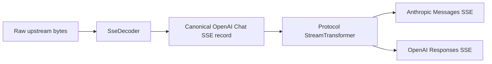
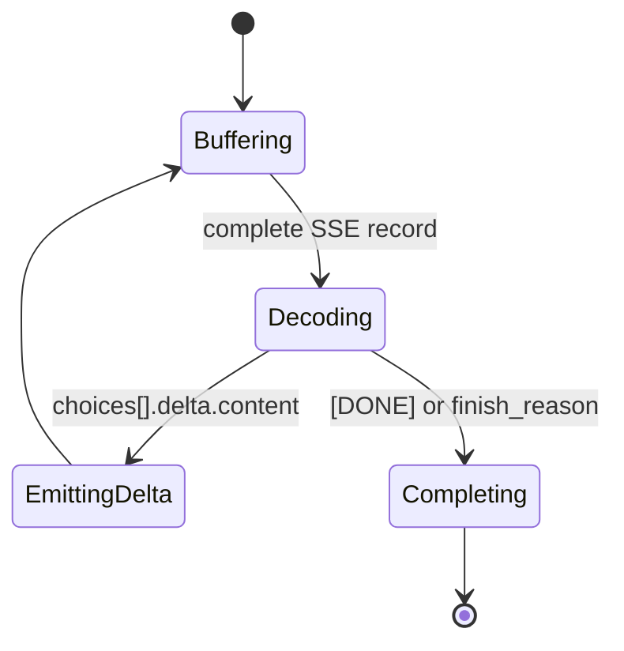

# Multi-Protocol Conversion Engine

| Field | Value |
| --- | --- |
| Document Version | 1.0 |
| Project Version | v0.2.0 |
| Status | Implemented |
| Last Updated | 2026-08-30 |
| Owner | revue-gate maintainers |
| Language | en |
| Source Document | docs/design/backend/multi-protocol-conversion-engine.md |
| Related ADR | docs/adr/0003-multi-protocol-conversion-engine.md |

> This is an English summary for open-source readers. The zh-CN design document is the source of truth.

## Purpose

The multi-protocol conversion engine is a downstream compatibility layer. It lets clients call revue-gate through OpenAI Chat Completions, Anthropic Messages, or OpenAI Responses while keeping the internal data plane unified around a Canonical Chat Protocol based on OpenAI Chat Completions.

The existing proxy use case remains responsible for authentication, quota checks, channel selection, security audit, retry, billing, and request logging.

```text
Client protocol
  -> interface/http
  -> protocol/
  -> Canonical Chat Protocol
  -> usecases/proxy.rs
  -> infrastructure/providers/
  -> Upstream provider
```

## Core Components

- `ProtocolKind` identifies the downstream protocol: `OpenAiChat`, `AnthropicMessages`, or `OpenAiResponses`.
- `CodecRegistry` is a thin static dispatcher. It is not a dynamic plugin registry and not a route planner.
- Protocol modules expose `to_openai_chat` and `from_openai_chat` conversion functions.
- `ConvertedRequest` and `ConvertedResponse` carry converted JSON bodies and conversion reports.
- `ConversionContext` provides request-local context such as `trace_id` and `now_unix`.
- `ConversionReport` records field mappings and normalization warnings as in-memory observability data.
- `ProtocolError` represents conversion failures before the request reaches the proxy path.
- `SseDecoder` and `StreamTransformer` handle streaming conversion from canonical OpenAI Chat SSE to downstream protocol SSE.

## Canonical Chat Protocol

Canonical Chat is the internal JSON shape used by the proxy path. It intentionally keeps the shared semantics that revue-gate can route, audit, forward, bill, and log safely:

- `model`
- `messages`
- `stream`
- text content
- system/user/assistant/tool roles
- custom function tools
- `tool_choice`
- generation controls such as `max_tokens`, `temperature`, `top_p`, and `stop`
- OpenAI-style `choices`
- OpenAI-style text SSE deltas

Unsupported semantics such as stateful Responses features, hosted tools, multimodal content, and thinking blocks fail closed instead of being silently dropped.

## Conversion Model

The engine uses `serde_json::Value` at protocol boundaries and validates only fields that affect conversion semantics. It does not model complete official OpenAI or Anthropic schemas as large Rust structs in v0.2.0.

Representative mappings:

| Source | Canonical Chat |
| --- | --- |
| Anthropic `system` + `messages` + `max_tokens` | `messages` + `max_tokens` |
| Anthropic `tools` / `tool_choice` | OpenAI Chat function tools / `tool_choice` |
| Responses `instructions` + `input` | canonical system/user messages |
| Responses `max_output_tokens` | `max_tokens` |
| Canonical `choices[0].message` | Anthropic `content[]` or Responses `output[]` |

OpenAI Chat Completions is treated as the passthrough codec, with minimal validation for the canonical request shape.

## Streaming Model

Streaming conversion is modeled as a small pipeline:



Simplified lifecycle:



OpenAI `[DONE]` is a canonical stream terminator. Anthropic Messages and OpenAI Responses transformers translate it into protocol-specific completion events instead of forwarding it directly.

## Layer Boundaries

| Layer | Owns | Does not own |
| --- | --- | --- |
| `interface/http` | routes, auth header extraction, trace id, HTTP status, protocol-specific error bodies, SSE response wrapping | field-level protocol conversion, provider calls |
| `protocol` | pure downstream protocol conversion and SSE grammar transformation | axum, reqwest, sqlx, channels, provider credentials |
| `usecases/proxy.rs` | auth, quota, routing, audit, retry, billing, request logging for canonical requests | Anthropic or Responses downstream request bodies |
| `infrastructure/providers` | upstream provider adaptation, HTTP transport, provider error masking, usage parsing | downstream client protocol routing |

## Logging Model

Request logs stay canonical:

- `request_body` stores the redacted Canonical Chat request body.
- `trace_id` is produced by the HTTP trace middleware.
- `response_choices` stores the redacted canonical OpenAI Chat `choices` JSON.

For streaming responses, the proxy stream bookkeeping accumulates text deltas and finish reason, then synthesizes an equivalent canonical `choices` array when the stream completes.

## Relationship To waliapi

This design is inspired by waliapi's separation between provider adapters and protocol conversion. revue-gate adopts the boundary idea, but keeps the first implementation smaller: downstream protocols are converted into Canonical Chat and then executed through the existing proxy path.

waliapi is a reference, not a runtime dependency or compatibility contract.

## Non-goals

This design does not cover endpoint-aware routing, native Anthropic or Responses upstream endpoint preference, Responses lifecycle endpoints, full official schema modeling, hosted tools, multimodal content, thinking blocks, persistent conversion reports, raw downstream payload logging, UI warning display, or streaming tool-call aggregation.
