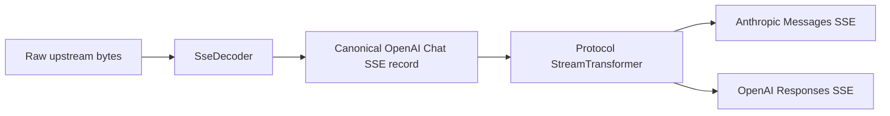
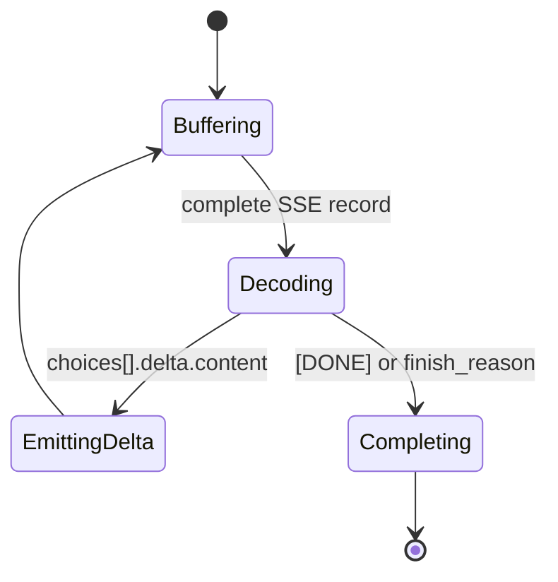

# 多协议转换引擎

| Field | Value |
| --- | --- |
| Document Version | 1.0 |
| Project Version | v0.2.0 |
| Status | Implemented |
| Last Updated | 2026-08-30 |
| Owner | revue-gate maintainers |
| Language | zh-CN |
| English Summary | docs/design/backend/multi-protocol-conversion-engine.en.md |
| Related ADR | docs/adr/0003-multi-protocol-conversion-engine.md |

> 本文档描述 revue-gate 多协议转换引擎的长期设计模型。它解释模块边界、核心组成、流式处理和日志策略；具体字段规则以当前代码为准。

## 为什么需要

revue-gate 原本主要暴露 OpenAI Chat Completions 兼容接口。随着客户端生态扩展，Anthropic SDK、OpenAI Responses API 客户端也需要自然调用本地网关。

多协议转换引擎的目标是：**屏蔽下游客户端协议差异，内部统一使用 OpenAI Chat Completions 形态的 Canonical Chat Protocol**。这样认证、配额、渠道选择、安全审计、重试、计费和日志仍然复用既有 `ProxyRequestUsecase` 闭环，不为每一种下游协议复制一条数据面。

核心请求流：

```text
Client protocol
  -> interface/http
  -> protocol/                  // downstream protocol conversion
  -> Canonical Chat Protocol
  -> usecases/proxy.rs           // auth, quota, routing, audit, retry, billing, logs
  -> infrastructure/providers/   // upstream provider adaptation
  -> Upstream provider
```

## 设计上下文

项目里已经有两类“协议兼容”问题，必须分开：

- `protocol` 处理下游客户端协议：Anthropic Messages、OpenAI Responses、OpenAI Chat Completions 如何进入 revue-gate。
- `ProviderAdaptor` 处理上游供应商协议：revue-gate 如何调用 OpenAI、Claude、Gemini、DeepSeek 或自定义 OpenAI-compatible endpoint。

这两个模块都在做“协议适配”，但方向完全不同。多协议转换引擎只负责 downstream compatibility，不接管 provider HTTP、provider credentials、provider error masking、upstream base URL、channel selection 或 retry policy。

## 核心组成

先用一张 cheatsheet 建立模块地图：

| 组成部分 | 代码位置 | 作用 | 关键边界 |
| --- | --- | --- | --- |
| `ProtocolKind` | `src-tauri/src/protocol/registry.rs` | 标识下游协议入口，也是 registry 分发 key | 只表达协议类型，不表达 provider、channel 或 endpoint capability |
| `CodecRegistry` | `src-tauri/src/protocol/registry.rs` | 统一分发 request/response/stream 转换 | 静态 dispatcher，不是动态注册中心，也不是 route planner |
| Conversion functions | `src-tauri/src/protocol/{openai_chat,anthropic,responses}.rs` | 执行协议到 Canonical Chat 的双向转换 | 只处理 downstream protocol shape，不处理 HTTP、DB 或 provider credentials |
| `ConvertedRequest` / `ConvertedResponse` | `src-tauri/src/protocol/registry.rs` | 承载转换结果、stream 标记和转换报告 | 不是完整官方 API schema，只是转换结果 envelope |
| `ConversionContext` | `src-tauri/src/protocol/context.rs` | 提供 `trace_id`、`now_unix` 等请求级上下文 | 只读上下文，不参与 routing、quota、billing 等业务决策 |
| `ConversionReport` | `src-tauri/src/protocol/report.rs` | 记录字段映射和 normalization warning | v0.2.0 仅为内存态观测对象，不持久化、不影响执行 |
| `ProtocolError` | `src-tauri/src/protocol/error.rs` | 表达协议转换阶段的失败原因 | 不表示 auth、quota、provider failure 或 gateway policy decision |
| `SseDecoder` | `src-tauri/src/protocol/sse.rs` | 缓冲并解析 canonical OpenAI Chat SSE record | 只解析 SSE record，不理解目标协议事件语义 |
| `StreamTransformer` | `src-tauri/src/protocol/registry.rs` + 各协议 `stream.rs` | 将 canonical SSE 转换成目标下游协议 SSE | 只转换已提交流，不做跨渠道重试或 provider 调度 |
| Scalar helpers | `src-tauri/src/protocol/scalars.rs` | 集中校验 token limit、required string、bool、number 等小字段 | 内部 helper，不升级为完整 schema validation framework |

### ProtocolKind

`ProtocolKind` 表示下游协议入口，也是 `CodecRegistry` 的分发 key：

- `OpenAiChat`
- `AnthropicMessages`
- `OpenAiResponses`

`OpenAiChat` 有双重含义：它既代表 `/v1/chat/completions` 下游端点，也代表系统内部的 Canonical Chat Protocol。

### CodecRegistry

`CodecRegistry` 是薄的静态 dispatcher，不是动态注册中心，也不是 route planner。它只根据 `ProtocolKind` 调用对应协议模块的转换函数：

```rust
match protocol {
    ProtocolKind::OpenAiChat => openai_chat::passthrough_request(request, context),
    ProtocolKind::AnthropicMessages => anthropic::to_openai_chat(request, context),
    ProtocolKind::OpenAiResponses => responses::to_openai_chat(request, context),
}
```

这个设计刻意保持小：当前版本不需要插件式 codec 注册，也不需要按照 provider 能力选择 native endpoint。

### Conversion Functions

每个非 canonical 协议模块都提供双向转换：

```rust
pub fn to_openai_chat(
    request: serde_json::Value,
    context: &ConversionContext,
) -> Result<ConvertedRequest, ProtocolError>;

pub fn from_openai_chat(
    response: serde_json::Value,
    context: &ConversionContext,
) -> Result<ConvertedResponse, ProtocolError>;
```

语义上：

- `to_openai_chat`：下游请求转换为 Canonical Chat request。
- `from_openai_chat`：Canonical Chat response 转换回下游协议响应。
- OpenAI Chat 自身走 passthrough codec，但仍经过 registry，保证三种协议入口的处理路径一致。

### ConvertedRequest And ConvertedResponse

`ConvertedRequest` 承载转换后的 canonical JSON body、是否流式、以及 `ConversionReport`。`ConvertedResponse` 承载转换后的下游响应 body 和 `ConversionReport`。

这些类型不表达完整官方协议 schema，只表达网关数据面需要继续处理的结果。

### ConversionContext And ConversionReport

`ConversionContext` 提供转换时需要的外部上下文，例如 `trace_id` 和 `now_unix`。它由 HTTP handler 创建，不进入 proxy usecase 的业务决策。

`ConversionReport` 是内存态观测对象，记录字段映射和 normalization warning。它当前不参与：

- security audit
- route selection
- quota
- billing
- retry
- request success/failure

它的存在是为了让后续 debug、UI 展示或持久化观测有稳定模型，而不是改变 v0.2.0 的数据面行为。

### ProtocolError

`ProtocolError` 表示“下游协议请求无法安全表示为 Canonical Chat”的原因。它属于 protocol 层，不知道 HTTP 状态码，也不描述 provider failure 或 gateway policy decision。

错误分类：

| Variant | 含义 |
| --- | --- |
| `MalformedRequest` | JSON 语法有效，但整体请求形状不符合预期 |
| `UnsupportedFeature` | 请求使用了当前 canonical path 无法安全表达的语义 |
| `MissingRequiredField` | 缺少目标协议或转换所需字段 |
| `InvalidField` | 已知字段类型、取值或语义形状错误 |
| `Stream` | SSE chunk 在当前边界无法解析或转换 |

HTTP 状态码和错误 body 由 `interface/http` 映射。

### SSE Streaming Layer

流式处理由两部分组成：

- `SseDecoder`：把任意切分的 upstream bytes 缓冲并解码成 canonical OpenAI Chat SSE record。
- `StreamTransformer`：把 canonical SSE record 转成目标下游协议的 SSE event。

OpenAI Chat 走 passthrough transformer；Anthropic Messages 和 OpenAI Responses 需要各自生成目标协议事件。

## Canonical Chat Protocol

Canonical Chat Protocol 是项目内部统一使用的 JSON 形态，基于 OpenAI Chat Completions，但不是完整 OpenAI 官方 API schema 的复制。

v0.2.0 选择的最小语义集合包括：

- `model`
- `messages`
- `stream`
- text content
- `system` / `user` / `assistant` / `tool` roles
- custom function tools
- `tool_choice`
- `max_tokens`
- `temperature`
- `top_p`
- `stop`
- OpenAI-style `choices`
- OpenAI-style text SSE delta

这些语义可以被现有 proxy path 路由、审计、转发、计费和日志化。

当前不属于 canonical 语义的内容包括：

- Responses persisted state，例如 `store`、`previous_response_id`、`conversation`
- hosted/server-side tools，例如 `web_search`、`file_search`、`computer_use`
- multimodal content
- thinking/reasoning blocks
- Anthropic native content-block stream 作为内部流格式

遇到这些语义时，protocol 层应该 fail closed，返回清晰的 `ProtocolError::UnsupportedFeature`，而不是静默丢字段。

## 转换模型

转换层使用 `serde_json::Value` 作为协议边界类型，只解析会影响语义转换的字段。它不是 schema-less conversion：重要字段会显式校验，无法表达的语义会拒绝。

不使用大型 Rust struct 建模完整 Anthropic / Responses schema 是一个刻意选择：

- 官方协议字段多且变化快，完整建模会带来维护负担。
- revue-gate 的目标是 gateway compatibility，不是实现完整官方 API server。
- 许多字段对 canonical path 没有安全语义，只能 preserve、normalize 或 reject。
- 对必须严格校验的小字段，使用 helper 或内部 newtype，例如 token limit validation。

概念映射：

| Source | Canonical Chat |
| --- | --- |
| Anthropic `system` + `messages` + `max_tokens` | `messages` + `max_tokens` |
| Anthropic `tools` / `tool_choice` | OpenAI Chat function tools / `tool_choice` |
| Anthropic `tool_use` / `tool_result` | assistant `tool_calls` / `tool` messages |
| Responses `instructions` + `input` | canonical `system` + `user` messages |
| Responses `max_output_tokens` | `max_tokens` |
| Canonical `choices[0].message` | Anthropic `content[]` or Responses `output[]` |

OpenAI Chat Completions 不做严格字段白名单，因为它是既有公开接口。registry passthrough 只校验最小必要形状，例如 `model`、`messages` 和 `stream` 类型，其他字段保持原样。

## 流式模型

流式转换的难点不是字段名，而是边界：网络 chunk 可以在任意位置切开，一个 chunk 也可能包含多个 SSE record。目标协议还可能要求补齐开始、delta、结束事件。

流处理管线：



简化状态转移：



这张图只表达生命周期，不覆盖每个 concrete transformer 内部的所有布尔状态。

核心伪代码：

```rust
for record in decoder.push(chunk)? {
    if record.is_done() {
        emit_target_completion_events();
        continue;
    }

    let delta = parse_canonical_delta(record)?;
    emit_target_delta_events(delta);
}

for record in decoder.finish()? {
    // flush trailing complete records or fail on incomplete SSE data
}
```

重要原则：OpenAI `[DONE]` 是 canonical stream terminator，不是 Anthropic Messages 或 OpenAI Responses 的下游事件。目标 transformer 会把它翻译成目标协议的 completion events，而不是直接转发。

## 错误模型

错误分两层：

| 层 | 职责 |
| --- | --- |
| `protocol` | 返回 `ProtocolError`，解释为什么请求/响应无法转换 |
| `interface/http` | 把 parse/auth/conversion/proxy 错误映射成目标协议 HTTP body |

HTTP 边界规则：

- JSON parse failure -> protocol-specific 400
- missing local API key -> protocol-specific 401
- `ProtocolError` -> protocol-specific 400
- `ProxyError` -> usecase-owned status，再包装成目标协议错误 body

`/v1/messages` 返回 Anthropic-style error JSON。`/v1/chat/completions` 和 `/v1/responses` 当前返回 OpenAI-style error JSON。

auth、quota、channel selection、security policy block、provider failure 仍然属于 proxy usecase，不应该塞进 `ProtocolError`。

## 分层边界

| 模块 | 职责 | 不应该做 |
| --- | --- | --- |
| `interface/http` | Axum route、header extraction、trace id、HTTP status、error body、SSE response wrapping | 字段级协议转换、provider 调用 |
| `protocol` | 纯 downstream protocol conversion、conversion report、SSE grammar transformation | 依赖 axum/reqwest/sqlx、读取 Channel、处理 provider credentials |
| `usecases/proxy.rs` | canonical request 的 auth、quota、routing、audit、retry、billing、request logging | 理解 Anthropic/Responses 下游 body |
| `infrastructure/providers` | upstream provider adaptation、provider HTTP、provider error masking、usage parsing | 接管下游客户端协议入口 |

这条边界保证新增下游协议时不会复制数据面，也保证新增上游 provider 时不会污染下游协议层。

## 日志模型

请求日志保持 canonical，而不是按下游协议保存：

- `request_body` 保存 redacted Canonical Chat request。
- `trace_id` 来自 HTTP trace middleware，用于请求关联。
- `response_choices` 保存 redacted canonical OpenAI Chat `choices` JSON。

非流式响应直接从 canonical response body 提取 `choices`。流式响应在 proxy stream bookkeeping 中累计 text delta 和 `finish_reason`，结束时合成等价的 canonical `choices`。

这样即使请求来自 `/v1/messages` 或 `/v1/responses`，日志仍然统一展示内部真实执行的 canonical payload，便于安全审计、问题复盘和后续统计。

不保存 Anthropic response body 或 Responses `output[]` 到 `response_choices`，因为它们是下游展示形态，不是内部执行形态。

## 测试策略

测试以 seam 为中心，而不是暴露内部 helper：

| Seam | 覆盖内容 |
| --- | --- |
| Protocol conversion seam | 通过 `CodecRegistry` 测 request/response 转换、错误分类、stream transformer |
| HTTP seam | 通过 `build_router` 测 route、auth header、protocol-specific error body、stream response |
| Logging seam | 测 canonical `request_body`、`trace_id`、canonical `response_choices` |

`SseDecoder`、token scalar helper 等内部工具优先通过公开 conversion/stream 行为间接覆盖。只有当 bug 表明某个 helper 需要独立回归测试时，才为它增加更聚焦的测试。

## Relationship To waliapi

这个设计受 `waliapi` 的 adaptor/protocol 分离启发，也采用了 canonical OpenAI Chat、canonical `response_choices` 和 streaming synthetic choices 的思路。

但 `waliapi` 是参考，不是运行时依赖，也不是兼容契约。revue-gate 当前实现刻意更小：下游协议先转换为 Canonical Chat，再进入既有 proxy path。

## Non-goals

当前设计不覆盖：

- endpoint-aware routing
- native Anthropic upstream endpoint preference
- native OpenAI Responses upstream endpoint preference
- Responses state lifecycle endpoints
- full official OpenAI / Anthropic schema modeling
- hosted tools and server-side tools
- multimodal input/output
- thinking/reasoning blocks
- persistent conversion reports
- raw downstream payload logging
- UI display for conversion warnings
- streaming tool-call aggregation

这些能力需要新的设计决策，不能通过扩大 `CodecRegistry` 职责偷偷塞进当前 protocol module。
